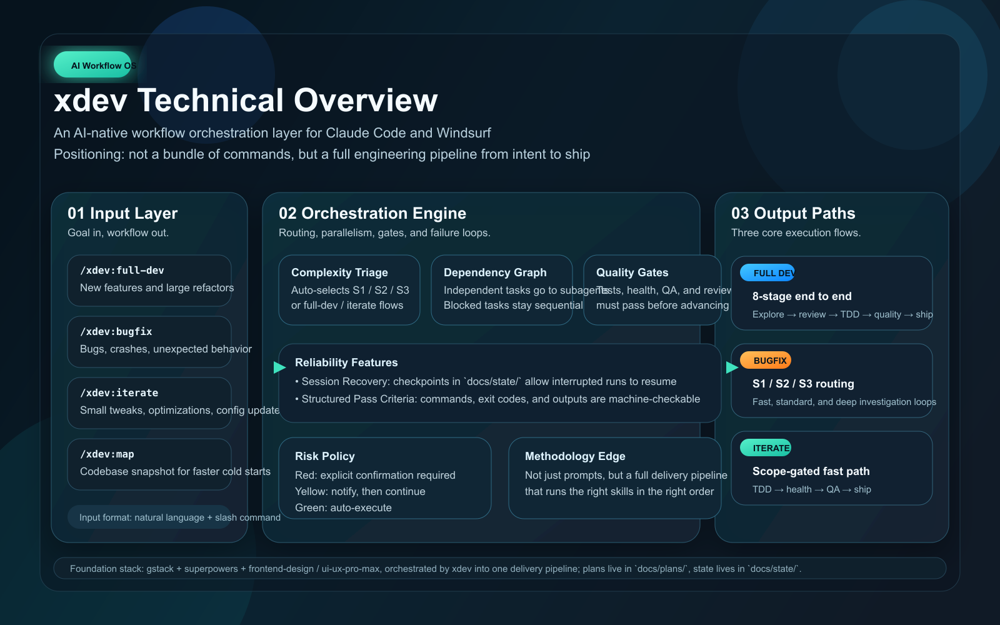
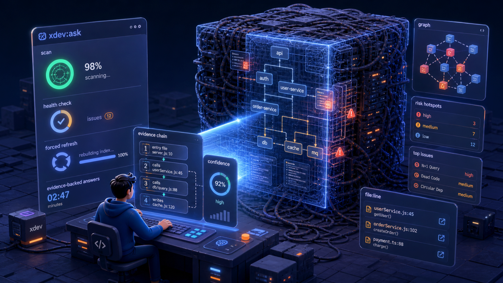

# xdev — AI-Native Development Workflows

> **Ship features, not ceremonies.** xdev is a set of production-grade AI workflow files for Windsurf and Claude Code that orchestrate the full development lifecycle — from brainstorming to production — with built-in quality gates, parallel execution, and tiered failure loops.

English | [中文](./README.zh.md)

---

## Overview



---

## Quick Start

Just describe what you need — xdev classifies the complexity, picks the right path, executes, verifies, and ships.

```
# Found a bug?
/xdev:bugfix  Login timeout crashes the app after 30 seconds

# Building a new feature?
/xdev:full-dev  Add dark mode support to the settings panel

# Small tweak?
/xdev:iterate  Reduce homepage load timeout from 5s to 3s

# Need to understand the project, or audit it for hidden risks?
/xdev:ask  How does the auth flow work?
/xdev:ask  Audit this project — what risks should I worry about?
```

> xdev auto-assesses severity → selects the right workflow → executes → verifies → ships. No hand-holding required.

---

## Why xdev?

There are plenty of AI command collections out there. Here's why xdev is different:

### vs. gstack / superpowers / oh-my-codex / oh-my-openagent

| | gstack / superpowers | oh-my-codex | oh-my-openagent | **xdev** |
|--|---------------------|-------------|-----------------|---------|
| What it is | Individual power tools | Prompt templates / slash commands | Multi-agent orchestration modes (team / ultrawork / autopilot) | **End-to-end workflow orchestration** |
| Scope | Single task per command | Single task per prompt | Parallel agent dispatch per command | **Full dev lifecycle (design → ship)** |
| Quality gates | ❌ | ❌ | ❌ | ✅ Pass/fail at every stage |
| Failure handling | ❌ | ❌ | ❌ | ✅ Retry limits + escalation paths |
| Cross-tool handoff | ❌ | ❌ | ❌ | ✅ Design in Opus, implement in Codex |
| Parallel execution | ❌ | ❌ | ✅ Explicit multi-agent modes | ✅ Subagent dispatch built into workflow |
| Tiered execution paths | ❌ | ❌ | ❌ | ✅ S1/S2/S3 for bugs (15 min vs 90 min) |
| Confirmation policy | ❌ | ❌ | ❌ | ✅ 🔴/🟡/🟢 three tiers |
| **Adaptive execution** | ❌ | ❌ | ❌ — user picks the mode | ✅ Self-assesses severity, auto-selects workflow and skills |
| **Dependency-aware parallelism** | ❌ | ❌ | ❌ — parallel by declaration, not by task graph | ✅ Analyzes task graph, runs independent tasks in parallel |
| **Cognitive load** | High — pre-map scenarios, manually chain tools | High — craft precise prompts for every variation | Medium — pick the right mode & agent mix per task | **Low — describe the goal, xdev decides how** |

> **Confirmation tiers:** 🔴 high-risk ops (git push, PR publish) — always confirm · 🟡 mid-risk (bulk file edits) — prompt by default · 🟢 low-risk (read files, run tests) — auto-execute

**gstack and superpowers are excellent tools** — xdev is the orchestration layer that knows *when*, *how*, and *in what order* to use them. Think of gstack as the power tools and xdev as the master workflow that coordinates them.

### Core philosophy: orchestration, not reinvention

xdev **doesn't reinvent the wheel**. superpowers and gstack already contain battle-tested skills — `investigate`, `health`, `qa`, `ship`, `browse`, `writing-plans`… these skills are already great on their own.

**xdev does something different: it uses a superior methodology to orchestrate those skills into an automated engineering pipeline.**

> The right skill, at the right moment, in the right order — that's the real leverage of AI-assisted development.

Calling `qa` on its own tests a feature. But xdev specifies: `qa` should only run *after* all TDD tests pass and `health` score hasn't dropped below pre-fix baseline; any issues found must be fixed and re-verified; only after 2 failed attempts does it fall back to manual verification. **The gap in methodology is what determines the gap in final delivery quality.**

### The core insight

Most AI workflows fail not because the AI can't code, but because:
1. **No quality gates** — the AI moves on before a stage is actually done
2. **One-size-fits-all** — a 2-line typo fix goes through the same ceremony as a new feature
3. **No failure protocol** — when a hypothesis fails, the AI keeps guessing instead of escalating
4. **Sequential when it should be parallel** — three independent reviews run one at a time

xdev solves all four.

### Adaptive execution — self-assess, then choose the right path

Other AI command tools hand you one pipeline. Whether the change is 2 lines or 200, everything runs through the same fixed serial workflow. xdev is different: **it evaluates first, then decides how to act.**

```
Read bug description / code state / change scope
        │
        ▼
  Classify severity automatically
  ├── S1: root cause obvious → fast path (no investigate, no health/qa)
  ├── S2: single-module, reproducible → standard path (inline probe, tests only)
  └── S3: cross-module / intermittent → deep path (full investigate + health + qa)
```

**Dependency analysis drives parallel execution:**

```
Analyze task dependency graph
  ├── Has dependencies → sequential, wait for prerequisites
  └── No dependencies → dispatch to subagents in parallel
                        (3 independent reviews → run simultaneously,
                         not queued one after another)
```

This is **self-directed execution**, not blind script following. The AI reads context, decides how much effort to invest, which skills to invoke, and which tasks can run concurrently — always choosing the most appropriate path, not the most conservative full-suite one.

---

## What's inside

6 workflow files that cover the complete development lifecycle:

| Workflow | Claude Code | Windsurf | When to use | Target time |
|----------|-------------|----------|-------------|------------|
| **full-dev** | `/xdev:full-dev` | `/full-dev` | New feature, large refactor, cross-module change | Hours–days |
| **full-dev-design** | `/xdev:full-dev-design` | `/full-dev-design` | Design phase only — produces a plan and hands off to Codex for implementation | 1–4 hours |
| **full-dev-impl** | `/xdev:full-dev-impl` | `/full-dev-impl` | Implementation phase only — reads the design plan and executes | Hours–days |
| **bugfix** | `/xdev:bugfix` | `/bugfix` | Bug, crash, unexpected behavior | 15 min–90 min |
| **iterate** | `/xdev:iterate` | `/iterate` | Small change, optimization, config tweak | 15–60 min |
| **ask** | `/xdev:ask` | `/ask` | Read-only project Q&A or proactive audit; top priority is "most current, most accurate answer" | 1–5 min |

> **Cross-tool handoff:** `full-dev-design` + `full-dev-impl` let you use the best model for each phase — plan with a powerful reasoning model (e.g. Opus), implement with a fast execution model (e.g. Codex). xdev handles the handoff automatically via a shared plan file.

### Concrete scenarios — pick the right command

Commands self-classify and degrade, so when in doubt just describe the goal. The list below is a quick mental model.

**`/xdev:full-dev`** — anything with unknowns, multiple stakeholders, or cross-module impact.
- Ship a new feature end-to-end: *"add a Subscriptions page with Stripe billing"*
- Large refactor: *"migrate API routes from Express 3 to Express 5"*
- Schema / contract changes that ripple: *"add `organization_id` to users + backfill + update all readers"*
- Anything where you'd want CEO/Eng/Design/DevEx review *before* writing code

**`/xdev:full-dev-design`** — design-only, hand off the plan to a different model/agent.
- Plan with Opus / GPT-5, implement with Codex / a faster model
- You want a TDD plan with risk-tagged tasks but won't write code yet
- The design needs heavy review and your impl agent has a smaller context window

**`/xdev:full-dev-impl`** — pick up an approved design plan and execute it.
- Resume from a `docs/plans/<slug>.md` produced by `full-dev-design`
- Multi-session work: design yesterday, implementation today
- Want a fast execution model running against a pre-locked plan

**`/xdev:bugfix`** — anything broken, crashing, or behaving wrong. Auto-tiers severity.
- *S1 fast (≤ 15 min)*: obvious typo, off-by-one, missing import, single-line regression
- *S2 standard (≤ 35 min)*: reproducible bug in one module — *"signup form rejects valid emails containing `+`"*
- *S3 deep (≤ 90 min)*: cross-module / intermittent / auth- or payment-sensitive — *"checkout occasionally double-charges customers"*

**`/xdev:iterate`** — small, in-scope tweak with no surprises. Auto-escalates if it grows.
- Copy / timeout / threshold / log-level changes
- Style polish on a single component
- ≤ ~100 lines, no new deps, no API contract change. Out of scope → escalates to `full-dev`; bug discovered → escalates to `bugfix`.

**`/xdev:ask`** — read-only Q&A and proactive audit. Never edits source, runs tests, or ships.



- *Question mode* (with concrete anchors — file / function / route / business term):
  - *"How does the login auth flow work end-to-end?"*
  - *"If I add field X to model Y, what breaks?"*
  - *"Where are the tests for the payment service, and which ones cover refunds?"*
  - *"What does `services/billing/charger.ts` actually do?"*
- *Audit mode* (no specific question — runs the 6-dimension health checklist):
  - *"Audit this project — what risks should I worry about?"*
  - Single-dimension focus: *"audit security"* / *"check test gaps"* / *"how's the architecture coupling?"*
  - Returns 5–10 high-value findings with file/line evidence; suggests `/bugfix` or `/iterate` for any actual fixes.

---

## Workflow Architecture

### /full-dev — 8-stage end-to-end pipeline

```
Stage 1: Requirement exploration (brainstorming / office-hours)
Stage 2: Plan review — parallel subagents (eng + design + devex + ceo as needed)
Stage 3: TDD implementation plan (writing-plans) with dependency annotations
         ── handoff point (optional, for cross-tool split) ──
Stage 4: Implementation — risk-gated parallel batches (L0–L3) + heartbeat + L3 audit
Stage 5+6: Quality + QA (parallel) — review(cond.) ‖ cso --diff(cond.) ‖ health ‖ qa ‖ design-review
Stage 7: Release — 7.1 ship (includes pre-landing review + auto document-release) → 7.2 land-and-deploy (optional)
Stage 8: Learning (learn — conditional trigger)
```

### Five built-in reliability features

**Session recovery** — Every workflow writes a state file to `docs/state/` at stage 3 and updates it at each subsequent stage. The state file embeds a `## Handoff Summary` block initialized at end of stage 3 and refreshed by the stage 4 mainline controller after every batch; stage 4 also records `mainline_checkpoints.next_batch`. If a session is interrupted mid-way, the next invocation detects the actual matched state file, runs a 3-way validation (branch match, HEAD still in history, plan file exists), reads the latest Handoff Summary, and resumes within stage 4 from `next_batch` when available instead of restarting from scratch. State files are gitignored and deleted automatically after a successful ship.

**Mainline controller** — In stage 4 the main thread acts as supervisor: it keeps a clean context (only design doc, Intent Contract, plan, Handoff Summary, task status, subagent receipts), splits the plan into narrow task packets carrying the relevant Intent Contract excerpt, and dispatches them to TDD subagents / teamagents based on risk + conflict matrix + dependencies. Subagents only execute their assigned packet; all output flows back to the mainline for aggregation. The mainline updates `mainline_checkpoints` and refreshes the Handoff Summary on every batch boundary, and pauses to re-align on user intent whenever a subagent returns `NEEDS_RECLASSIFY` / `BLOCKED`, the Gatekeeper reports `DEVIATION`, evidence misses pass criteria, or the plan diverges from code reality. Prevents long-context drift and unilateral scope expansion.

**Structured pass criteria** — Every task in the stage-3 plan now carries a machine-checkable `pass criteria` block: the exact verification command, expected exit code, required output strings, and optional extra assertions (e.g. a `curl` probe). Subagents may not commit unless all criteria pass. Subagent C validates that the "must-contain" string is actually derivable from the verification command's real output.

**Risk-gated stage 4** — Every task in the stage-3 plan carries a `risk` classification (L0 trivial / L1 local / L2 cross-module / L3 critical) that drives stage 4 orchestration: executor packets are narrowed per risk level, reviews are sampled (L1 per-module) or mandatory (L2/L3), L3 tasks get an independent audit subagent writing sidecars to `docs/state/audits/<slug>/`, and subagent progress is tracked by a risk-aware heartbeat (L1 5/10min, L2 8/15min, L3 15/25min) that kills and re-dispatches possibly-stuck runs before escalating to the user. Cuts typical stage 4 wall time ~90min → 45–60min while preserving quality gates on shared/auth/finance-sensitive code.

**Auto codebase snapshot** — When a workflow needs basic project context (tech stack, directory layout, dev/test commands) and doesn't already have it, it runs a built-in shallow scan and writes the result to `docs/state/codebase-snapshot.md` (gitignored). Subsequent invocations read the snapshot for instant cold-start context. The snapshot carries a freshness check (branch + commit + 7-day expiry) and a truncation marker so the model knows when output was cut off. There is no separate "map the project" command — the workflows decide when to run this themselves; for deeper questions use `/xdev:ask` or escalate to Graphify (Step 2.6).

### /bugfix — three-tier root-cause pipeline

```
Severity classification (S1 / S2 / S3)
  │
  ├── S1: fix → test → push                              (≤ 15 min)
  ├── S2: inline investigation → TDD → full tests → ship (≤ 35 min)
  └── S3: investigate → TDD → health + qa → ship → learn (≤ 90 min)
```

### /iterate — scope-gated fast path

```
Scope check (6 dimensions: lines / files / modules / deps / API / bug?)
  │
  ├── Out of scope → escalate to /full-dev
  ├── Bug found   → escalate to /bugfix
  └── In scope    → TDD → health → ship
```

### Project context resolution — auto snapshot vs Graphify

xdev resolves project context **autonomously** at the start of every workflow. There is no separate "understand the project" command — the workflow self-classifies and picks the right depth.

```
Task starts
  │
  ▼
Does the task need project-level understanding?
  ├── No → Level 0: skip scanning, use the prompt as-is
  └── Yes
       ├── Only basic structure / commands / test patterns
       │     → Level 1: run the built-in shallow scan, read docs/state/codebase-snapshot.md
       │
       └── Architecture / cross-module / call chains / design intent / global state
             ├── graphify-out/{graph.json, GRAPH_REPORT.md} fresh
             │     → Level 3: read GRAPH_REPORT.md + targeted `graphify query`
             │
             ├── `command -v graphify` ok but graph missing/stale
             │     ├── current agent can run the Graphify skill pipeline
             │     │     → Level 2: initialize/refresh the graph (privacy gate first)
             │     └── otherwise → fall back to Level 1
             │
             └── Graphify not installed
                   → mention it as optional (README Step 2.6) and fall back to Level 1
```

Key rules:
- **CLI ≠ skill pipeline.** `command -v graphify` only proves the CLI exists (good for queries and code-only AST refresh via `graphify update .`); first full graph initialization additionally requires the current agent environment to be able to run the Graphify skill pipeline.
- **No auto-install, no auto-automation.** Workflows never run `graphify install`, `graphify watch`, or `graphify hook install`. Installation lives only in README Step 2.6 and runs on user request.
- **Privacy gate.** First full initialization or any semantic refresh of docs/PDF/images/audio/video is 🔴 — the workflow must explain that semantic extraction can call the underlying model API and wait for confirmation. Code-only AST refresh is 🟡 (notify and continue).
- **Token discipline.** Workflows read `GRAPH_REPORT.md` plus focused `graphify query "<question>" --graph graphify-out/graph.json` results. Full `graph.json` is never injected into context.
- **Always degrade gracefully.** Missing Graphify, failed init, failed update, or stale snapshot all degrade to the Level-1 shallow scan (or skip) and the workflow continues.

Per-workflow defaults:

| Workflow | Default depth | Deep path trigger |
|----------|---------------|-------------------|
| `/iterate` | Level 0/1 only | If deep context is needed → escalate to `/full-dev` or `/bugfix` (no deep scan inside iterate) |
| `/bugfix` S1/S2 | Level 1 | S3 deep path: read `GRAPH_REPORT.md` → `graphify query`; init only if Level 2 conditions met |
| `/full-dev` | Adaptive Level 0–3 | Source of truth for the lifecycle and execution boundary |
| `/full-dev-design` | Level 0/1, Level 2 when architecture judgment is needed | Defers to `/full-dev` lifecycle |
| `/full-dev-impl` | Trusts the design plan; supplements with `graphify query` only when the plan is insufficient | Defers to `/full-dev` lifecycle |
| `/ask` | Adaptive Level 1–3, with "most current, most accurate answer" as top priority; installed Graphify treated as implicit authorization | Fresh graph → query directly; code changes → 🟡 auto `graphify update .`; semantic changes or first-time build → 🟡 auto `graphify .`, transparently disclosing cost without re-confirming; user says "don't refresh / don't build" → skip immediately + `Unknowns` annotation |

---

## Installation

### TL;DR — install xdev itself in one line

```bash
git clone --depth 1 https://github.com/Minokun/xdev.git ~/.claude/skills/xdev
~/.claude/skills/xdev/bin/install.sh claude    # or: windsurf / windsurf --project
```

Done. `/iterate` and `/ask` (rg mode) work right away. Heavy commands (`/full-dev`, `/bugfix`, `/ask` with Graphify audit) need extra skills, but xdev **degrades gracefully** to the runnable subset when they're missing — it won't crash.

### Pick your install tier (choose what you need)

xdev itself is just workflow files; the heavy lifting is done by external skills. Install only what you need:

| What you want to use | Install | Cumulative time |
|----------------------|---------|-----------------|
| `/iterate`, `/ask` (rg mode) | **xdev itself** (required) | 1 min |
| `/bugfix` full S1/S2/S3 triage | + **gstack** (Step 2) | +3 min |
| `/full-dev` full pipeline (design + reviews + ship) | + **gstack** + **superpowers** (Steps 1 + 2) | +5 min |
| `/full-dev` stage 1.5 visual design | + **ui-ux-pro-max** (Step 2.5) | +2 min |
| `/ask` audit mode + `/full-dev` deep architecture | + **Graphify** (Step 2.6; installing it is treated as implicit authorization for LLM extraction) | +2 min |

> **Graceful-degradation guarantee**: if a skill is missing, xdev silently skips the related stage instead of erroring. Start with the core and add deps as needed.

### Let Claude Code install everything (alternative)

If you use Claude Code and want the AI to install everything in one shot, paste this into any Claude Code session:

```
Please install xdev and its dependencies for me:

1. xdev itself (required):
   Run: git clone --depth 1 https://github.com/Minokun/xdev.git ~/.claude/skills/xdev
   Then: ~/.claude/skills/xdev/bin/install.sh claude

2. gstack (recommended — /bugfix full triage + /full-dev pipeline):
   Run: git clone --single-branch --depth 1 https://github.com/garrytan/gstack.git ~/.claude/skills/gstack && cd ~/.claude/skills/gstack && ./setup

3. superpowers (recommended — brainstorming + engineering skill suite):
   Run: /plugin install superpowers@claude-plugins-official

4. ui-ux-pro-max (optional — UI/UX design skill):
   Run: /plugin marketplace add nextlevelbuilder/ui-ux-pro-max-skill
   Then: /plugin install ui-ux-pro-max@ui-ux-pro-max-skill

5. Graphify (optional — deep project understanding):
   Run: uv tool install graphifyy
   Verify: graphify --help
   Note: the PyPI package is graphifyy; do not install the unrelated graphify package.

After all steps complete, confirm the files are in place and tell me which xdev commands are now available.
```

> The prompt above only covers Claude Code. Other agents should follow the per-step details below.

---

## Per-step details

### Step 1 — Install superpowers

superpowers provides the `brainstorming` skill used in xdev (lightweight requirement exploration for simple features), plus a broader suite of development workflow skills (`writing-plans`, `test-driven-development`, `systematic-debugging`, `dispatching-parallel-agents`, etc.) that Claude Code agents can draw on during execution.

**Claude Code (official marketplace — easiest):**
```
/plugin install superpowers@claude-plugins-official
```

**Claude Code (custom marketplace):**
```
/plugin marketplace add obra/superpowers-marketplace
/plugin install superpowers@superpowers-marketplace
```

**Windsurf / Cursor:** Search for `superpowers` in the plugin marketplace.

**Codex / OpenCode:** Tell the AI to fetch and follow `https://raw.githubusercontent.com/obra/superpowers/refs/heads/main/.codex/INSTALL.md`

### Step 2 — Install gstack

gstack provides the core engineering skills used by xdev: `office-hours`, `plan-ceo-review`, `plan-eng-review`, `plan-design-review`, `plan-devex-review`, `design-consultation`, `review`, `cso`, `health`, `qa`, `qa-only`, `design-review`, `devex-review`, `browse`, `investigate`, `ship`, `land-and-deploy`, `canary`, `autoplan`, `learn`.

**Requirements:** Git, [Bun v1.0+](https://bun.sh)

**Claude Code:**
```bash
git clone --single-branch --depth 1 https://github.com/garrytan/gstack.git ~/.claude/skills/gstack
cd ~/.claude/skills/gstack && ./setup
```

**Codex / OpenCode / Cursor / Windsurf / other supported agents:**
```bash
git clone --single-branch --depth 1 https://github.com/garrytan/gstack.git ~/gstack
cd ~/gstack && ./setup --host codex   # or: opencode / cursor / windsurf / factory / slate / hermes / kiro
```

### Step 2.5 — Install ui-ux-pro-max

`ui-ux-pro-max` provides end-to-end UI/UX design support: design-system generation, product-type reasoning, style/color/typography search, interaction guidance, and stack-specific UI rules. Used in `full-dev` / `full-dev-design` stage 1.5 when building new products or complex UIs.

**Claude Code (marketplace):**
```
/plugin marketplace add nextlevelbuilder/ui-ux-pro-max-skill
/plugin install ui-ux-pro-max@ui-ux-pro-max-skill
```

**Codex / Windsurf / Cursor / OpenCode / other agents (CLI — recommended):**
```bash
npm install -g uipro-cli
uipro init --ai codex      # or: claude / windsurf / cursor / opencode / all
```

**Update an existing CLI install:**
```bash
npm install -g uipro-cli
uipro update --ai codex    # or your assistant target
```

### Step 2.6 — Install Graphify (optional, recommended for deep project understanding)

Graphify provides the deep project context layer used when xdev needs architecture boundaries, cross-module relationships, call chains, design rationale, or global project-state judgment.

Graphify is **optional**. If it is not installed, xdev workflows must fall back to the built-in Level-1 shallow scan and continue.

**Requirements:** Python 3.10+.

**Recommended global CLI install:**
```bash
uv tool install graphifyy
graphify --help
```

**Fallback if you use pipx:**
```bash
pipx install graphifyy
graphify --help
```

**Important:** the official PyPI package is `graphifyy`, while the CLI command is `graphify`. Do not install the unrelated `graphify` package.

**Optional: enable the Graphify skill pipeline for your agent**

The CLI is enough for existing graph queries and code-only updates. First full graph initialization requires the Graphify skill pipeline to be available in the current agent environment.

Claude Code example:

```bash
graphify install --platform claude
```

For other supported agents, run `graphify --help` and choose the matching install target. xdev workflows must not run these install/configuration commands automatically.

**Execution policy inside xdev workflows:**
- Detect Graphify CLI with `command -v graphify` before query/update/check-update steps.
- Never auto-install Graphify or run `graphify install` inside a normal workflow run.
- If Graphify is missing, tell the user it is an optional enhancement and continue with the built-in Level-1 shallow scan.
- If a graph already exists, prefer `graphify-out/GRAPH_REPORT.md` and focused `graphify query` output over reading the full `graph.json`.
- Installing Graphify does not scan the project. First graph initialization is only triggered by xdev workflows when a Level 2 task needs deep architecture/call-chain context, the shallow snapshot is insufficient, and the current agent can run the Graphify skill pipeline.
- For existing graphs, code-only refreshes may use `graphify check-update .` and `graphify update .`; semantic refreshes for docs/media/sensitive materials require user confirmation.
- `command -v graphify` only proves the CLI exists; it is enough for existing graph queries and code-only updates, but not by itself enough to guarantee first full graph initialization.
- Do not enable `graphify install`, `graphify watch`, `graphify hook install`, or other platform/persistent automation unless the user explicitly asks for it.

### Step 3 — Install xdev itself

Clone the repository to a fixed location:

```bash
git clone --depth 1 https://github.com/Minokun/xdev.git ~/.claude/skills/xdev
```

Run the install script (idempotent — safe to re-run; creates, updates, and repairs symlinks):

```bash
# Claude Code (global)
bash ~/.claude/skills/xdev/bin/install.sh claude

# Windsurf (global)
bash ~/.claude/skills/xdev/bin/install.sh windsurf

# Windsurf (project-level — links into the current project's .windsurf/workflows/, version-controlled with your repo)
cd /path/to/your/project
bash ~/.claude/skills/xdev/bin/install.sh windsurf --project

# Install for both agents at once
bash ~/.claude/skills/xdev/bin/install.sh all

# Preview without writing
bash ~/.claude/skills/xdev/bin/install.sh windsurf --dry-run

# Custom target directory (advanced)
bash ~/.claude/skills/xdev/bin/install.sh windsurf --target /your/custom/path
```

Invoke with:

```
Claude Code: /xdev:full-dev    /xdev:full-dev-design    /xdev:full-dev-impl    /xdev:bugfix    /xdev:iterate    /xdev:ask
Windsurf:    /full-dev          /full-dev-design          /full-dev-impl          /bugfix          /iterate          /ask
```

**Updating xdev:**

```bash
cd ~/.claude/skills/xdev && git pull
```

> Claude Code uses a directory symlink — `git pull` alone keeps it up to date; no need to re-run the install script.
> Windsurf uses per-file symlinks. If a release adds or renames a workflow file, re-run `bash ~/.claude/skills/xdev/bin/install.sh windsurf` to refresh the symlinks.

### Skill dependency map

| Skill | Source | Used in |
|-------|--------|---------|
| `superpowers:brainstorming` | [superpowers](https://github.com/obra/superpowers) | full-dev / full-dev-design stage 1 (simple features) |
| `office-hours` | [gstack](https://github.com/garrytan/gstack) | full-dev / full-dev-design stage 1 (large features) |
| `design-consultation` | gstack | full-dev / full-dev-design stage 1.1 (new product with no design system) |
| `plan-eng-review` | gstack | full-dev stage 2 (always) |
| `plan-design-review` | gstack | full-dev stage 2 (UI changes) |
| `plan-devex-review` | gstack | full-dev stage 2 (API changes) |
| `plan-ceo-review` | gstack | full-dev stage 2 (large features) |
| `autoplan` | gstack | full-dev stage 2 (full-stack, Claude Code only) |
| `investigate` | gstack | bugfix S3 |
| `health` | gstack | full-dev, bugfix S3, iterate |
| `qa` | gstack | full-dev, bugfix S3 (UI), iterate |
| `design-review` | gstack | full-dev stage 5+6 (UI changes), bugfix S3 (UI) |
| `devex-review` | gstack | full-dev stage 5+6 (API / CLI / SDK changes) |
| `review` | gstack | full-dev stage 5+6 (conditional: new deps / arch changes / security) |
| `cso` | gstack | full-dev stage 5+6 (conditional: auth / payment / PII / secrets) |
| `browse` | gstack | bugfix S2 UI verification |
| `ship` | gstack | all workflows |
| `land-and-deploy` | gstack | full-dev stage 7.2 (optional: merge PR + CI + production health check) |
| `learn` | gstack | full-dev, bugfix S3 |
| `graphify` CLI | [Graphify](https://github.com/safishamsi/graphify) (`graphifyy` package) | optional deep project context for full-dev / full-dev-design / bugfix S3 |
| `ui-ux-pro-max` | [nextlevelbuilder](https://github.com/nextlevelbuilder/ui-ux-pro-max-skill) | full-dev / full-dev-design stage 1.5 (new products / complex UI) |
| `frontend-design` | [Anthropic skills](https://github.com/anthropics/skills/tree/main/skills/frontend-design) / locally installed skill | full-dev / full-dev-design stage 1.5 (single page / small components) |

> xdev degrades gracefully if individual skills are missing — the workflow file will call the skill and it simply won't execute if not installed.

---

## Design Principles

1. **Right-sized process** — Small bug = small process. Big feature = big process. Never the other way around.
2. **Root cause, not symptoms** — No fix without evidence. No evidence without investigation.
3. **Tests first** — Regression tests must fail before the fix, pass after. No exceptions.
4. **Atomic commits** — Every change is independently bisect-able.
5. **Parallel when independent** — Reviews, health+QA run concurrently when there are no dependencies.
6. **Explicit escalation** — Every failure path has a defined next step. No infinite loops.
7. **Minimal footprint** — Don't refactor what you didn't break. Don't review what you didn't change.

---

## Gate Types: Mechanical vs Judgement

xdev uses two fundamentally different kinds of quality gates. Mixing them up is a common failure mode — this section fixes the terminology.

### Mechanical Gate

- **Adjudicator**: a script or command
- **Signal**: exit code, exact string match (grep), reproducible byte-for-byte
- **Examples**: `pass criteria` — `expected exit code = 0`, `output must contain "1 passed"`, `curl probe returns 200`
- **Rule**: **must be strictly binary** (pass / fail). No grey zone, no "close enough".

### Judgement Gate

- **Adjudicator**: an LLM or a human
- **Signal**: semantic evaluation — two runs on the same input may differ slightly
- **Examples**: `health ≥ 7/10`, `review` with no unresolved HIGH issues, `design-review` visual compliance, `plan-*-review` HIGH/MEDIUM count
- **Rule**: rubrics and scores are acceptable **but the evaluation dimensions must be enumerated** (no opaque "overall good"). Each dimension passes independently — never average dimensions into a single comprehensive score.

### What not to do

**Do not forcibly binarize a judgement gate into a single Yes/No.** A single binary like "is the code well-designed?" creates false precision — the LLM still has to make a judgement call, you just lose the resolution. The real win from binarization only applies to mechanical gates (where a script can actually decide).

Corollary: when tightening a gate, first ask "is this mechanical or judgement?". Mechanical → add exit code / grep / probe. Judgement → add an evaluation dimension, not a Yes/No.

> See `docs/CHANGELOG.md` for the history of this distinction — including which directions were tried and rejected. *(Note: the CHANGELOG is written in Chinese.)*

---

## File Structure

```
xdev/
├── README.md              ← This file (English)
├── README.zh.md           ← Chinese version
├── bin/                   ← Install scripts
│   └── install.sh         ← Idempotent symlink installer
├── windsurf/              ← Source for .windsurf/workflows/ symlinks
│   ├── full-dev.md
│   ├── full-dev-design.md
│   ├── full-dev-impl.md
│   ├── bugfix.md
│   ├── iterate.md
│   └── ask.md
└── claude-code/           ← Source for .claude/commands/xdev/ symlinks
    ├── full-dev.md
    ├── full-dev-design.md
    ├── full-dev-impl.md
    ├── bugfix.md
    ├── iterate.md
    └── ask.md
```

---

## Contributing

Contributions are welcome! Feel free to:

- Open an issue for bugs, questions, or workflow suggestions
- Submit a PR to improve or extend existing workflow files
- Share how you've adapted xdev for your own stack

---

## License

[MIT](./LICENSE)
