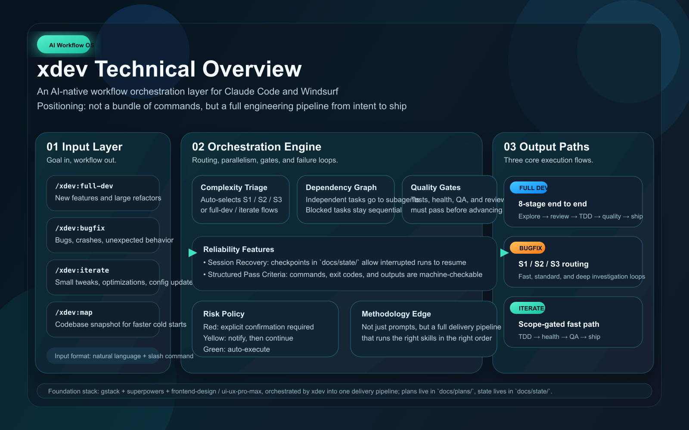

# xdev — AI-Native Development Workflows

> **Ship features, not ceremonies.** xdev is a set of production-grade AI workflow files for Claude Code, Codex CLI, and dsh (DeepSeek Harness) that orchestrate the full development lifecycle — from brainstorming to production — with built-in quality gates, parallel execution, and tiered failure loops.

English | [中文](./README.zh.md) | [Release notes](./CHANGELOG.md)

> **⚠️ Windsurf IDE is no longer supported (v3.0.0).** The `windsurf/` port and the `install.sh windsurf` target have been removed. If you relied on them, stay on the [v2.3.0 tag](https://github.com/Minokun/xdev/tree/v2.3.0) or migrate to Claude Code / Codex / dsh.

---

## Overview



---

## Quick Start (dsh / DeepSeek Harness)

**dsh is the flagship target.** xdev ships as a first-class dsh agent preset — "xdev 模式" — with its own persona, tool stack, and preset-private skills. `git clone` IS the installer (the repo root already carries the generated preset files):

```bash
git clone --depth 1 https://github.com/Minokun/xdev.git ~/.dsh/.agent-presets/xdev
```

Non-default dsh home? Use `${DSH_HOME:-$HOME/.dsh}/.agent-presets/xdev`.

Start (or restart) dsh — the mode selector now shows **xdev 模式**. Invoke the workflows as dsh gestures (they also work mid-sentence; xdev auto-routes even without a gesture):

```
/xdev-full-dev  Add dark mode support to the settings panel
/xdev-bugfix     Login timeout crashes the app after 30 seconds
/xdev-iterate    Reduce homepage load timeout from 5s to 3s
/xdev-ask        How does the auth flow work?
```

**Why dsh is the best fit** — dsh gives xdev's core mechanisms first-class runtime primitives instead of prose conventions:

| xdev concept (prose, in other agents) | dsh primitive (enforced) |
|---|---|
| "spawn fresh reviewers that haven't seen this conversation" | `spawn` provider with `inheritsParentContext: false` — freshness is a contract |
| "run the 3 reviews in parallel, dropped = unknown" | `workflow` tool: `parallel()` is a real barrier, `agent()` failure resolves `null` and is counted |
| "reviewers must return structured verdicts" | `agent(prompt, {schema})` — JSON-Schema-validated output |
| "strong model plans, cheap model implements" | `agent(prompt, {provider, model})` per subagent |

**Upgrading / uninstalling:**

```bash
git -C ~/.dsh/.agent-presets/xdev pull      # upgrade
rm -rf ~/.dsh/.agent-presets/xdev           # uninstall
```

Design rationale: [`docs/experiments/dsh-integration/RESEARCH.md`](./docs/experiments/dsh-integration/RESEARCH.md).

## Quick Start (Claude Code / Codex CLI)

### 1. Install (one minute)

Clone xdev once, then pick your agent target(s) — multi-select supported:

```bash
git clone --depth 1 https://github.com/Minokun/xdev.git ~/.claude/skills/xdev

# Pick one — or pass several at once
bash ~/.claude/skills/xdev/bin/install.sh claude         # Claude Code
bash ~/.claude/skills/xdev/bin/install.sh codex          # Codex CLI (prompts + skills)
bash ~/.claude/skills/xdev/bin/install.sh claude codex   # multi-select
bash ~/.claude/skills/xdev/bin/install.sh all            # = claude + codex
```

That's enough to use `/iterate` and `/ask` (rg mode) immediately. Heavier commands (`/full-dev`, `/bugfix`, `/ask` with Graphify audit) need extra skills — see [Installation](#installation) for the per-tier setup. xdev **degrades gracefully** when optional skills are missing.

### 2. Just describe what you need

xdev classifies the complexity, picks the right path, executes, verifies, and ships.

```
# Found a bug?
/xdev:bugfix  Login timeout crashes the app after 30 seconds

# Building a new feature?
/xdev:full-dev  Add dark mode support to the settings panel

# Small tweak?
/xdev:iterate  Reduce homepage load timeout from 5s to 3s

# Need to understand the project, or audit it for hidden risks?
/xdev:ask  How does the auth flow work?
/xdev:ask  Audit this project — what risks should I worry about?
```

> Examples above use the Claude Code prefix. On Codex use `/prompts:xdev-full-dev …` or `$xdev-full-dev …`; on dsh use `/xdev-full-dev …`.

> xdev auto-assesses severity → selects the right workflow → executes → verifies → ships. No hand-holding required.

### Optional: pair a strong main model with lightweight subagents

xdev makes heavy use of Claude Code subagents for independent reviews and implementation batches. For the best cost/performance balance, run the main conversation on your strongest model and route subagents through Claude Code's `haiku` alias:

```json
{
  "env": {
    "ANTHROPIC_MODEL": "gpt-5.5",
    "ANTHROPIC_DEFAULT_HAIKU_MODEL": "gpt-5.4",
    "CLAUDE_CODE_SUBAGENT_MODEL": "haiku"
  }
}
```

With this setup, the main thread keeps the higher-reasoning model for planning, orchestration, and final judgment, while every spawned subagent defaults to `haiku` (mapped here to `gpt-5.4`). This is especially effective in xdev because subagents handle many bounded, parallel tasks; sending those to the lighter model can substantially reduce token spend while preserving the stronger model for the decisions that matter most.

---

## Why xdev?

**The one sentence:** xdev keeps only the three mechanisms that extract truth a model cannot get from its own context — and deletes every other rule.

Modern models are already strong. Most "workflow rules" just restate what the model would do anyway — dead weight. The three things worth keeping, in plain words:

1. **A fresh pair of eyes on your work.** Every gate is a brand-new subagent that has never seen the main conversation — it can't be biased by the "I did it right" narrative. Your plan gets judged by someone who doesn't know the story, not by the person who wrote it.
2. **Check the books against code, not memory.** Before coding: the plan goes through a binary gate (approve/reject, forced rework). After coding: the diff gets audited against the original design (drift check). What happened along the way doesn't matter — **whether the accounts reconcile** does.
3. **Tests must actually run.** "Should pass" isn't passing. Commands execute for real, outputs are read for real, background jobs are watched to completion.

Why this is worth it: strong models have blind spots that don't disappear — they just move. Our controlled experiment quantified it: the best review combination still misses 20% of planted defects, while an independent gate caught real bugs in already-shipped code. xdev doesn't teach the model to work (it already can) — it guarantees **a second pair of eyes is always present, and the cost of being wrong is always paid early**: bad plans get rejected before code is written, bad changes get caught by adversarial review before merge.

And the hidden value: peace of mind. The whole workflow is 196 lines + 5 hard rules, which in plain words are: *"Verification must actually run · verdicts must be honored · don't touch the main branch · ask before irreversible actions · everything else, use your judgment."* That last clause is the point — a model with judgment should use it; the workflow only guards what it would miss when fooling itself.

---

There are plenty of AI command collections out there. Here's the detailed comparison:

### vs. gstack / superpowers / oh-my-codex / oh-my-openagent

| | gstack / superpowers | oh-my-codex | oh-my-openagent | **xdev** |
|--|---------------------|-------------|-----------------|---------|
| What it is | Individual power tools | Prompt templates / slash commands | Multi-agent orchestration modes (team / ultrawork / autopilot) | **End-to-end workflow orchestration** |
| Scope | Single task per command | Single task per prompt | Parallel agent dispatch per command | **Full dev lifecycle (design → ship)** |
| Quality gates | ❌ | ❌ | ❌ | ✅ Pass/fail at every stage |
| Failure handling | ❌ | ❌ | ❌ | ✅ Retry limits + escalation paths |
| Cross-tool handoff | ❌ | ❌ | ❌ | ✅ Design in Opus, implement in Codex |
| Parallel execution | ❌ | ❌ | ✅ Explicit multi-agent modes | ✅ Subagent dispatch built into workflow |
| Tiered execution paths | ❌ | ❌ | ❌ | ✅ S1/S2/S3 for bugs (one-line fix vs. cross-module investigation) |
| Confirmation policy | ❌ | ❌ | ❌ | ✅ explicit 🔴 user-confirm gates (irreversible ops, big-feature design) |
| **Adaptive execution** | ❌ | ❌ | ❌ — user picks the mode | ✅ Self-assesses severity, auto-selects workflow and review depth |
| **Dependency-aware parallelism** | ❌ | ❌ | ❌ — parallel by declaration, not by task graph | ✅ Analyzes task graph, runs independent tasks in parallel |
| **Cognitive load** | High — pre-map scenarios, manually chain tools | High — craft precise prompts for every variation | Medium — pick the right mode & agent mix per task | **Low — describe the goal, xdev decides how** |

> **🔴 gates** (the only user-confirm points): irreversible ops — production deploy, data deletion, force-push, external release (hard rule 4) — and the design of cross-module / irreversible features. Everything else notifies and continues.

### Core philosophy: information extraction, not ritual

Modern models are strong — most "workflow rules" just restate what the model would do anyway, and those rules are dead weight. xdev v2 keeps only mechanisms that **extract information the model cannot get for free from its own context**:

1. **Fresh-context review** (independent reviewers with no parent-conversation bias)
2. **Diff-vs-design drift checking** (what the code actually does vs what was agreed)
3. **Really executed tests/commands** (objective output, not "should pass")

Everything else — stage rituals, output formats, taxonomy tables — is a *default the model may deviate from*, not a cage. All review prompts are built in; **xdev has zero required external skill dependencies** (gstack / superpowers no longer needed; their essence lives on in the built-in prompts).

> Evidence: the Sansheng A/B experiment (`docs/experiments/sansheng/PROPOSAL.md`) showed strong reviewers still have orthogonal blind spots — 3 reflections missed 8 real defects that a gate caught on landed plans, and the gate caught only 1/6 BDD defects that a reflection caught 6/6. (Cost: the gate arm ran at 57–67% of baseline tokens, missing its ≤55% target — which is why it ships opt-in.) Independent perspectives don't become redundant as models get smarter; the blind spots just move.

Running the test suite on its own tells you whether it passes. But xdev specifies *when* it counts: a UI check only runs *after* the full suite and lint/build really passed with no new failures versus the pre-change baseline; any issue found must be fixed and re-verified; only after 2 failed rounds does it fall back to manual verification. **The gap in methodology is what determines the gap in final delivery quality.**

### The core insight

Most AI workflows fail not because the AI can't code, but because:
1. **No quality gates** — the AI moves on before a stage is actually done
2. **One-size-fits-all** — a 2-line typo fix goes through the same ceremony as a new feature
3. **No failure protocol** — when a hypothesis fails, the AI keeps guessing instead of escalating
4. **Sequential when it should be parallel** — three independent reviews run one at a time

xdev solves all four.

### Adaptive execution — self-assess, then choose the right path

Other AI command tools hand you one pipeline. Whether the change is 2 lines or 200, everything runs through the same fixed serial workflow. xdev is different: **it evaluates first, then decides how to act.**

```
Read bug description / code state / change scope
        │
        ▼
  Classify severity automatically
  ├── S1: root cause obvious → fast path (no subagent, focused tests only)
  ├── S2: single-module, reproducible → standard path (inline probe, full tests)
  └── S3: cross-module / intermittent → deep path (fresh investigation subagent + full tests + UI check)
```

**Dependency analysis drives parallel execution:**

```
Analyze task dependency graph
  ├── Has dependencies → sequential, wait for prerequisites
  └── No dependencies → dispatch to subagents in parallel
                        (3 independent reviews → run simultaneously,
                         not queued one after another)
```

This is **self-directed execution**, not blind script following. The AI reads context, decides how much effort to invest, which reviews to dispatch, and which tasks can run concurrently — always choosing the most appropriate path, not the most conservative full-suite one.

---

## What's inside

6 workflow files that cover the complete development lifecycle:

| Workflow | Claude Code | Codex | dsh | When to use | Target time |
|----------|-------------|-------|-----|-------------|------------|
| **full-dev** | `/xdev:full-dev` | `/prompts:xdev-full-dev` | `/xdev-full-dev` | New feature, large refactor, cross-module change | Hours–days |
| **full-dev-design** | `/xdev:full-dev-design` | `/prompts:xdev-full-dev-design` | — | Design phase only — produces a plan and hands off for implementation | 1–4 hours |
| **full-dev-impl** | `/xdev:full-dev-impl` | `/prompts:xdev-full-dev-impl` | — | Implementation phase only — reads the design plan and executes | Hours–days |
| **bugfix** | `/xdev:bugfix` | `/prompts:xdev-bugfix` | `/xdev-bugfix` | Bug, crash, unexpected behavior | 15 min–90 min |
| **iterate** | `/xdev:iterate` | `/prompts:xdev-iterate` | `/xdev-iterate` | Small change, optimization, config tweak | 15–60 min |
| **ask** | `/xdev:ask` | `/prompts:xdev-ask` | `/xdev-ask` | Read-only project Q&A or proactive audit; top priority is "most current, most accurate answer" | 1–5 min |

> **dsh note:** on dsh, `full-dev-design` / `full-dev-impl` are folded into `/xdev-full-dev` — dsh's per-subagent `model` option replaces the cross-tool handoff files (strong model plans, cheap model implements).

> **Cross-tool handoff:** `full-dev-design` + `full-dev-impl` let you use the best model for each phase — plan with a powerful reasoning model (e.g. Opus), implement with a fast execution model (e.g. Codex). xdev handles the handoff automatically via a shared plan file.

### Concrete scenarios — pick the right command

Commands self-classify and degrade, so when in doubt just describe the goal. The list below is a quick mental model.

**`/xdev:full-dev`** — anything with unknowns, multiple stakeholders, or cross-module impact.
- Ship a new feature end-to-end: *"add a Subscriptions page with Stripe billing"*
- Large refactor: *"migrate API routes from Express 3 to Express 5"*
- Schema / contract changes that ripple: *"add `organization_id` to users + backfill + update all readers"*
- Anything where you'd want CEO/Eng/Design/DevEx review *before* writing code

**`/xdev:full-dev-design`** — design-only, hand off the plan to a different model/agent.
- Plan with Opus / GPT-5, implement with Codex / a faster model
- You want a TDD plan with risk-tagged tasks but won't write code yet
- The design needs heavy review and your impl agent has a smaller context window

**`/xdev:full-dev-impl`** — pick up an approved design plan and execute it.
- Resume from a `docs/plans/<slug>.md` produced by `full-dev-design`
- Multi-session work: design yesterday, implementation today
- Want a fast execution model running against a pre-locked plan

**`/xdev:bugfix`** — anything broken, crashing, or behaving wrong. Auto-tiers severity.
- *S1 fast*: obvious typo, off-by-one, missing import, single-line regression
- *S2 standard*: reproducible bug in one module — *"signup form rejects valid emails containing `+`"*
- *S3 deep*: cross-module / intermittent / auth- or payment-sensitive — *"checkout occasionally double-charges customers"*

**`/xdev:iterate`** — small, in-scope tweak with no surprises. Auto-escalates if it grows.
- Copy / timeout / threshold / log-level changes
- Style polish on a single component
- ≤ ~100 lines, no new deps, no API contract change. Out of scope → escalates to `full-dev`; bug discovered → escalates to `bugfix`.

**`/xdev:ask`** — read-only Q&A and proactive audit. Never edits source, runs tests, or ships.


- *Question mode* (with concrete anchors — file / function / route / business term):
  - *"How does the login auth flow work end-to-end?"*
  - *"If I add field X to model Y, what breaks?"*
  - *"Where are the tests for the payment service, and which ones cover refunds?"*
  - *"What does `services/billing/charger.ts` actually do?"*
- *Audit mode* (no specific question — runs the 6-dimension health checklist):
  - *"Audit this project — what risks should I worry about?"*
  - Single-dimension focus: *"audit security"* / *"check test gaps"* / *"how's the architecture coupling?"*
  - Returns 5–10 high-value findings with file/line evidence; suggests `/bugfix` or `/iterate` for any actual fixes.

---

## Workflow Architecture

### /full-dev — 4-stage end-to-end pipeline

```
Stage 1: Design — features F1..Fn / Must-Not / acceptance criteria (scale-adaptive; 🔲 user confirm only for big/irreversible features)
Stage 2: Plan & gates — task breakdown → 3 fresh reviewers (coverage ‖ dependency ‖ BDD quality)
         [+ Menxia Gate (opt-in --menxia): binary approve/reject, forced rework ≤3 rounds]
         ── handoff point (optional, for cross-tool split) ──
Stage 3: Implement & test — TDD red-green per task, parallel dispatch by task graph,
         drift check (diff vs Intent Contract), conditional deep review (auth/payment/schema)
Stage 4: Deliver — full tests (really executed) → adversarial pre-landing review → PR → optional deploy
```

**5 hard rules** (everything else is a deviable default): verification must really run · fresh verdicts must be honored · never commit to base branch · irreversible actions need user confirmation · defaults may be skipped with a one-line reason.

### Built-in reliability features

**Session recovery / cross-tool handoff** — At the end of stage 2 the flow writes a minimal state file `docs/state/xdev--<branch>.md` (branch / stage / plan path / next action) and commits the plan. `/full-dev-impl` resumes from that file's next action without replaying the conversation; a missing plan or an anchor commit no longer in history → ask the user to re-plan, never guess. v2-format state files (`full-dev-design--<branch>--<slug>.md`) are not parsed — the flow tells you to finish them with v2 or re-plan.

**Base-branch guard** (hard rule 3) — Never commit to `main`/`master`. On the base branch, create an `xdev-<slug>` feature branch first — optionally in a `git worktree` (remember worktrees don't carry `.env*` or build artifacts). Worktrees are removed at stage 4 once the PR is merged.

**Intent Contract + drift check** — The design doc's F1..Fn / Must-Not / acceptance criteria, once confirmed, are the *Intent Contract*. After each batch (~5 commits) a fresh subagent reads only the contract, the design doc and the diff (appendix B) and reports `[偏离]` (interface / data-flow / module-boundary mismatch, with file:line) and `[超纲]` (user-visible capability with no contract entry). Any deviation → the user may only fix code; changing the design means explicitly going back to stage 1.

**Worker receipts, mainline aggregation** — Independent tasks are dispatched to parallel subagents that return only a receipt (files touched / commands run / real output summary / problems). Workers never write state; the main thread merges receipts and owns the state file. This keeps the supervising context small and prevents unilateral scope creep.

**No silent loss of failed reviewers** — If any of the 3 plan-reflection subagents fails or times out it is retried once; on second failure it's marked `missing` and its dimension's HIGH count is treated as *unknown, i.e. present* — no pass verdict on incomplete data. Background commands must be polled to completion ("will handle it later" stop-turns violate hard rule 1).

**Adversarial pre-landing review** — Before the PR, a fresh subagent is told to assume the diff *will* cause a production incident and to find the three most likely paths (data loss > security > regression > performance), each with a trigger path and file:line evidence — and to report fewer than three rather than invent them (appendix D). Conditional deep review (appendix C) is added when the diff touches auth / payment / PII / schema / new dependencies.

**Menxia Gate (opt-in, `--menxia`)** — A fresh reviewer gives a binary approve/reject on the whole plan with design-deference (approved / exempted / non-goal decisions in the design are never grounds for rejection) and injection-guard clauses; rejection forces a revision with per-item change notes, re-reviewed ≤3 rounds, and from round 2 the reviewer first verifies the change notes against the actual plan diff (4/5 fake revisions were caught in the N4 experiment). Gray-release: after ≥3 real tasks, promote or remove.

**Single source of truth** — `claude-code/` is the only hand-edited source. The dsh preset artifacts (`preset.yml`, `agent.cordis.yml`, `skills/xdev-*/`) are generated by `bin/gen-dsh.mjs` and committed so `git clone` is a complete install; `tests/workflows.test.mjs` fails if they are stale, if any workflow re-introduces external skill calls, or if `bugfix` / `iterate` grow past their thin-shell budget.

### /bugfix — root cause first, then the full-dev stage 3–4 loop

```
Tier (S1 quick / S2 standard / S3 deep — decided by evidence, not by clock)
  ├── S1: regression test → fix → focused tests → push branch (no PR)
  ├── S2: inline probe → TDD → full tests → deliver
  └── S3: git blame/bisect → stuck? fresh investigation subagent → TDD → full tests + UI check → deliver
Intent Contract for the drift/scope check = the root-cause report's "expected impact range"
```

### /iterate — scope-gated fast path

```
Scope gate (<100 lines · ≤5 files · ≤2 modules · no new deps · no public-API change)
  ├── auth / payment / schema / public API / new page → /full-dev
  ├── describes wrong behaviour, not a change → /bugfix
  └── in scope → list direct callers of shared files (rg) → TDD → full tests + lint/build → deliver
```

### Project context — no ceremony

Workflows read the project's own `CLAUDE.md` / `AGENTS.md` and use `rg` + file reads. There is no built-in "snapshot" or "understand the project" step. `/ask` additionally uses a Graphify graph when one is present (see Step 2.6) and degrades to `rg` when it isn't — every answer states which data source it rests on.

---

## Installation

### TL;DR — install xdev itself in one line

```bash
git clone --depth 1 https://github.com/Minokun/xdev.git ~/.claude/skills/xdev
~/.claude/skills/xdev/bin/install.sh claude    # or: codex / "claude codex" / "all"
```

Done. `/iterate` and `/ask` (rg mode) work right away. Heavy commands (`/full-dev`, `/bugfix`, `/ask` with Graphify audit) need extra skills, but xdev **degrades gracefully** to the runnable subset when they're missing — it won't crash. For dsh, see the [Quick Start (dsh)](#quick-start-dsh--deepseek-harness) above — one `git clone`, no install script needed.

### Pick your install tier (choose what you need)

xdev itself is just workflow files; the heavy lifting is done by external skills. Install only what you need:

xdev v2 is **self-contained** — install xdev itself and everything works:

| What you want to use | Install | Cumulative time |
|----------------------|---------|-----------------|
| `/iterate`, `/ask`, `/bugfix`, `/full-dev` (full pipeline) | **xdev itself** | 1 min |
| **dsh "xdev 模式" preset** (all of the above as native dsh skills) | `git clone` into `~/.dsh/.agent-presets/xdev` — see [Quick Start (dsh)](#quick-start-dsh--deepseek-harness) | 1 min |
| Optional: code-graph context for `/ask` | Graphify (installing = implicit authorization for LLM extraction) | +2 min |

> External skill libraries (gstack / superpowers) are **no longer referenced or required**.

### Let Claude Code install everything (alternative)

If you use Claude Code and want the AI to install everything in one shot, paste this into any Claude Code session:

```
Please install xdev and its dependencies for me:

1. xdev itself (required):
   Run: git clone --depth 1 https://github.com/Minokun/xdev.git ~/.claude/skills/xdev
   Then: ~/.claude/skills/xdev/bin/install.sh claude
   (If I also use Codex CLI, replace `claude` with any combination, e.g. `claude codex`, or `all`.)

2. Graphify (optional — used only by /ask):
   Run: uv tool install graphifyy
   Verify: graphify --help
   Note: the PyPI package is graphifyy; do not install the unrelated graphify package.

After all steps complete, confirm the files are in place and tell me which xdev commands are now available.
```

> The prompt above only covers Claude Code. Other agents should follow the per-step details below.

---

## Per-step details

> **Steps 1–2 removed (v2):** xdev no longer depends on superpowers or gstack. Their genuinely useful review logic
> (plan reflection, drift check, adversarial pre-landing review) has been internalized as built-in prompts in
> `full-dev.md`. Skip straight to the optional extras below.

### Step 2.6 — Graphify (optional; only `/ask` uses it)

[Graphify](https://github.com/Graphify-Labs/graphify) builds a code knowledge graph that `/ask` queries for architecture / call-chain / dead-code questions. Without it `/ask` falls back to `rg` and says so in `Unknowns`. Nothing else in xdev depends on it.

```bash
uv tool install graphifyy          # Python 3.10+
graphify --version
```

Then run the `/graphify` skill once in your project to build `graphify-out/`. `/ask` refreshes the graph automatically when it detects staleness (code-only via `graphify update .`; semantic re-extraction via the skill, with cost disclosed). xdev never runs `graphify install` / `watch` / `hook install`.

### Step 3 — Install xdev itself

Clone the repository to a fixed location:

```bash
git clone --depth 1 https://github.com/Minokun/xdev.git ~/.claude/skills/xdev
```

Run the install script (idempotent — safe to re-run; creates, updates, and repairs symlinks):

```bash
# Claude Code (global)
bash ~/.claude/skills/xdev/bin/install.sh claude

# Codex CLI (installs both custom prompts and skills — see below for invocation)
bash ~/.claude/skills/xdev/bin/install.sh codex

# Multi-select: pass any combination (equivalent to `all` minus what you skip)
bash ~/.claude/skills/xdev/bin/install.sh claude codex
bash ~/.claude/skills/xdev/bin/install.sh all                # = claude codex

# Preview without writing
bash ~/.claude/skills/xdev/bin/install.sh claude --dry-run

# Custom target directory (advanced; not supported with codex)
bash ~/.claude/skills/xdev/bin/install.sh claude --target /your/custom/path
```

#### Windows (native, via Git Bash)

xdev installs directly against **native Windows** Codex CLI / Claude Code — same per-agent paths as macOS/Linux, just under `%USERPROFILE%`. The installer is bash-only, so you run it from **Git Bash** (one-time, ships with [Git for Windows](https://gitforwindows.org/)). No WSL involved.

One-time setup:

1. Install Git for Windows if you don't already have it (gives you Git Bash).
2. Enable **Developer Mode** so non-admin users can create symlinks:
   `Settings → System → For developers → Developer Mode → On` (Windows 10 1607+ / Windows 11). Without this, `ln -s` falls back to copying or fails.

Then in Git Bash:

```bash
git clone --depth 1 https://github.com/Minokun/xdev.git "$USERPROFILE/.claude/skills/xdev"
bash "$USERPROFILE/.claude/skills/xdev/bin/install.sh" codex          # Codex only
bash "$USERPROFILE/.claude/skills/xdev/bin/install.sh" claude codex   # multi-select
bash "$USERPROFILE/.claude/skills/xdev/bin/install.sh" all
```

Targets land in the standard Windows locations the agents already read from:

| Agent | Windows path |
|---|---|
| Claude Code | `%USERPROFILE%\.claude\commands\xdev\` |
| Codex prompts | `%USERPROFILE%\.codex\prompts\` |
| Codex skills | `%USERPROFILE%\.agents\skills\` |
| dsh preset | `%USERPROFILE%\.dsh\.agent-presets\xdev\` (git clone) |

> No native PowerShell installer is shipped today. If `pwsh bin/install.ps1` would meaningfully improve your flow, please open an issue.

Invoke with:

```
Claude Code:     /xdev:full-dev          /xdev:full-dev-design          /xdev:full-dev-impl          /xdev:bugfix          /xdev:iterate          /xdev:ask
Codex (prompts): /prompts:xdev-full-dev  /prompts:xdev-full-dev-design  /prompts:xdev-full-dev-impl  /prompts:xdev-bugfix  /prompts:xdev-iterate  /prompts:xdev-ask
Codex (skills):  $xdev-full-dev          $xdev-full-dev-design          $xdev-full-dev-impl          $xdev-bugfix          $xdev-iterate          $xdev-ask
dsh preset:      /xdev-full-dev          (design/impl folded in)        (design/impl folded in)      /xdev-bugfix          /xdev-iterate          /xdev-ask
```

> **Codex install layout.** Picking the `codex` target installs both interfaces side-by-side so you can pick whichever fits the moment:
> - `~/.codex/prompts/xdev-*.md` — symlinks to `claude-code/*.md`. Invoke explicitly with `/prompts:xdev-<name>` (Codex's deprecated-but-still-supported custom prompt path; preserves `argument-hint`).
> - `~/.agents/skills/xdev-*/SKILL.md` — generated wrappers (regenerated on each install, marked with `<!-- xdev-generated -->`). Invoke explicitly with `$xdev-<name>` or rely on Codex's implicit description matching. The wrapper delegates to the same `claude-code/*.md` file, so a single `git pull` updates both surfaces.

**Updating xdev:**

```bash
cd ~/.claude/skills/xdev && git pull
```

> Claude Code uses a directory symlink — `git pull` alone keeps it up to date; no need to re-run the install script.
> Codex uses per-file symlinks plus generated `SKILL.md` wrappers. If a release adds, renames, or rewords the description of a workflow file, re-run the install script with the same agent target(s) to refresh links and regenerate skill wrappers.
> dsh keeps its own clone — update with `git -C ~/.dsh/.agent-presets/xdev pull` (or set `DSH_HOME` accordingly).

### Skill dependency map (v2: none required)

xdev v2 has **zero required skill dependencies**. The capabilities formerly provided by gstack / superpowers
live on as built-in prompts inside the workflow files:

| Former skill | Now |
|---|---|
| `plan-eng-review` / `plan-design-review` / `plan-devex-review` / `plan-ceo-review` | built-in 3-reflection plan review (`full-dev.md` appendix A1–A3) |
| `office-hours` / `superpowers:brainstorming` | stage 1 design conversation (scale-adaptive, no separate skill) |
| Gatekeeper drift check | built-in drift check prompt (appendix B) |
| `review` / `cso` | conditional deep-review prompt (appendix C) |
| `ship` pre-landing review | built-in adversarial pre-landing review (appendix D) |
| `health` / `qa` | really-executed test/lint/build commands in stage 4 |
| `learn` | optional one-line retro in stage 4 |
| `investigate` | `/bugfix` blame/bisect + fresh investigation subagent |
| `graphify` CLI | optional, used only by `/ask` (Step 2.6) |
| `ui-ux-pro-max` | no longer referenced by any workflow; install it independently if you want design guidance |

> If you have gstack / superpowers installed, they continue to work independently of xdev — xdev just no longer calls them.

---

## Design Principles

1. **Right-sized process** — Small bug = small process. Big feature = big process. Never the other way around.
2. **Root cause, not symptoms** — No fix without evidence. No evidence without investigation.
3. **Tests first** — Regression tests must fail before the fix, pass after. No exceptions.
4. **Atomic commits** — Every change is independently bisect-able.
5. **Parallel when independent** — Reviews and independent tasks run concurrently when there are no dependencies.
6. **Explicit escalation** — Every failure path has a defined next step. No infinite loops.
7. **Minimal footprint** — Don't refactor what you didn't break. Don't review what you didn't change.

---

## Gate Types: Mechanical vs Judgement

xdev uses two fundamentally different kinds of quality gates. Mixing them up is a common failure mode — this section fixes the terminology.

### Mechanical Gate

- **Adjudicator**: a script or command
- **Signal**: exit code, exact string match (grep), reproducible byte-for-byte
- **Examples**: `pass criteria` — `expected exit code = 0`, `output must contain "1 passed"`, `curl probe returns 200`
- **Rule**: **must be strictly binary** (pass / fail). No grey zone, no "close enough".

### Judgement Gate

- **Adjudicator**: an LLM or a human
- **Signal**: semantic evaluation — two runs on the same input may differ slightly
- **Examples**: plan reflection HIGH/MEDIUM count, drift-check `[偏离]`/`[超纲]` tally, Menxia approve/reject, pre-landing review findings, `/iterate` scope-gate escalation
- **Rule**: rubrics and scores are acceptable **but the evaluation dimensions must be enumerated** (no opaque "overall good"). Each dimension passes independently — never average dimensions into a single comprehensive score.

### What not to do

**Do not forcibly binarize a judgement gate into a single Yes/No.** A single binary like "is the code well-designed?" creates false precision — the LLM still has to make a judgement call, you just lose the resolution. The real win from binarization only applies to mechanical gates (where a script can actually decide).

Corollary: when tightening a gate, first ask "is this mechanical or judgement?". Mechanical → add exit code / grep / probe. Judgement → add an evaluation dimension, not a Yes/No.

> See `docs/CHANGELOG.md` for the history of this distinction — including which directions were tried and rejected. *(Note: the CHANGELOG is written in Chinese.)*

---

## File Structure

```
xdev/
├── README.md              ← This file (English)
├── README.zh.md           ← Chinese version
├── preset.yml             ← dsh preset metadata (GENERATED by gen-dsh — "xdev 模式")
├── agent.cordis.yml       ← dsh preset composition (GENERATED — persona + tool stack)
├── skills/                ← dsh preset-private skills (GENERATED from claude-code/)
│   ├── xdev-ask/SKILL.md
│   ├── xdev-bugfix/SKILL.md
│   ├── xdev-iterate/SKILL.md
│   └── xdev-full-dev/SKILL.md
├── docs/experiments/      ← Sansheng + dsh-integration research (dsh preset rationale)
├── bin/
│   ├── install.sh         ← Idempotent symlink installer (claude / codex)
│   └── gen-dsh.mjs        ← Generates the dsh preset artifacts from claude-code/
└── claude-code/           ← Single hand-edited source; .claude/commands/xdev/ + Codex prompts symlink here
    ├── full-dev.md
    ├── full-dev-design.md
    ├── full-dev-impl.md
    ├── bugfix.md
    ├── iterate.md
    └── ask.md
```

---

## Contributing

Contributions are welcome! Feel free to:

- Open an issue for bugs, questions, or workflow suggestions
- Submit a PR to improve or extend existing workflow files — edit `claude-code/`, then run `node bin/gen-dsh.mjs` and `node --test tests/`
- Share how you've adapted xdev for your own stack

---

## License

[MIT](./LICENSE)
