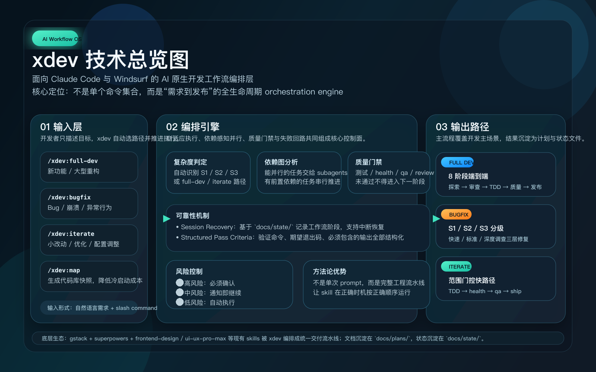

# xdev — AI 原生开发工作流

> **专注交付，而非仪式。** xdev 是一套面向 Windsurf 和 Claude Code 的生产级 AI 工作流文件，将完整开发生命周期（从需求到发布）的编排、质量门禁、并行执行和失败回路全部内置其中。

[English](./README.md) | 中文

---

## 项目总览图



---

## 快速上手

告诉 xdev 你要做什么——它自动判断复杂度、选路径、执行、验证、发布，不需要手把手引导。

```
# 发现了 bug？
/xdev:bugfix  登录超时后 app 直接崩溃

# 开发新功能？
/xdev:full-dev  给设置页面增加深色模式支持

# 小改动？
/xdev:iterate  把首页加载超时从 5s 改为 3s
```

> xdev 自动评估严重程度 → 选择对应工作流 → 执行 → 验证 → 发布。

---

## 为什么用 xdev？

AI 命令集合已经很多了。xdev 的不同之处在于：

### 对比 gstack / superpowers / oh-my-codex / oh-my-openagent

| | gstack / superpowers | oh-my-codex | oh-my-openagent | **xdev** |
|--|---------------------|-------------|-----------------|---------|
| 本质 | 独立的 AI 工具命令 | Prompt 模板 / 斜杠命令 | 多 Agent 编排模式（team / ultrawork / autopilot） | **端到端工作流编排** |
| 覆盖范围 | 每条命令处理单一任务 | 每个 Prompt 处理单一任务 | 每条命令按模式并行派发多个 Agent | **完整开发生命周期（设计 → 发布）** |
| 质量门禁 | ❌ | ❌ | ❌ | ✅ 每个阶段有明确通过条件 |
| 失败处理 | ❌ | ❌ | ❌ | ✅ 重试上限 + 升级路径 |
| 跨工具交接 | ❌ | ❌ | ❌ | ✅ Opus 做设计，Codex 做实现 |
| 并行执行 | ❌ | ❌ | ✅ 显式的多 Agent 模式 | ✅ Subagent 并行派发已内建进工作流 |
| 分级执行路径 | ❌ | ❌ | ❌ | ✅ Bug 分 S1/S2/S3（15 分钟 vs 90 分钟） |
| 确认策略 | ❌ | ❌ | ❌ | ✅ 🔴/🟡/🟢 三级控制 |
| **自适应执行** | ❌ | ❌ | ❌ — 由用户挑选模式 | ✅ 自判断难易等级，自选流程和 skill |
| **依赖感知并行** | ❌ | ❌ | ❌ — 按声明并行，不分析任务依赖 | ✅ 分析任务依赖，子代理并行无依赖项 |
| **认知负荷** | 高 — 预判所有场景，手动串联工具 | 高 — 每次都要编写精准 Prompt | 中 — 每次任务需挑对模式和 Agent 组合 | **低 — 只需描述目标，xdev 决定怎么做** |

> **确认三级说明：** 🔴 高风险操作（git push、PR 发布）—— 必须确认 · 🟡 中风险（批量文件修改）—— 默认提示 · 🟢 低风险（读文件、跑测试）—— 自动执行

**gstack 和 superpowers 是优秀的工具** —— xdev 是知道*何时、如何、按什么顺序*使用这些工具的编排层。把 gstack 理解成电动工具，xdev 是统一调度这些工具的施工方案。

### 核心理念：编排，而非重造

xdev **不重复造轮子**。superpowers、gstack 里已经有大量经过实战打磨的优秀 skill —— `investigate`、`health`、`qa`、`ship`、`browse`、`writing-plans`……这些 skill 本身已经足够好。

**xdev 做的是另一件事：用更合理的方法论，把这些 skill 编排成一套自动化的工程流水线。**

> 正确的 skill，在正确的时机，以正确的顺序执行 —— 这才是 AI 辅助开发的真正杠杆。

单独调用 `qa` skill 能测试一个功能；但 xdev 告诉你：这个 `qa` 应该在 TDD 全部通过、`health` 评分不低于修复前之后才跑，跑完发现的问题必须修复后重检，超过 2 次才降级手工验证。**方法论的差距，决定了最终交付质量的差距。**

### 核心洞察

AI 工作流失败的原因通常不是 AI 写不了代码，而是：

1. **没有质量门禁** —— AI 还没完成就进入了下一阶段
2. **一刀切流程** —— 改两行错别字和开发新功能走同一套重型流程
3. **没有失败协议** —— 假设验证失败后 AI 继续猜测，而不是升级
4. **该并行时串行** —— 三个互不依赖的审查依次排队执行

xdev 解决了这四个问题。

### 自适应执行 —— 自我评估，自主选择路径

其他 AI 命令工具给你一套流程，无论改动是 2 行还是 200 行都走同样的串行流水线。xdev 不同：**它在执行前先评估，再决定怎么干。**

```
读取 bug 描述 / 代码状态 / 改动范围
        │
        ▼
  自动判断难易等级
  ├── S1: 根因一眼可见 → 快速路（不调 investigate，不跑 health/qa）
  ├── S2: 单模块可复现 → 标准路（内联调查，只跑全量测试）
  └── S3: 跨模块/偶发  → 深度路（完整 investigate + health + qa）
```

**任务依赖分析驱动并行：**

```
分析任务依赖图
  ├── 有依赖关系 → 串行，等待前置任务完成
  └── 无依赖关系 → 子代理并行派发，同时执行
                   （3 个独立审查 → 同时跑，而不是依次排队）
```

这是**自主判断执行**，不是盲目跟随固定脚本。AI 读懂上下文，决定投入多大力度、用哪些工具、哪些任务可以并发 —— 每次都选最合适的路径，而不是最保险的全套流程。

---

## 包含什么

6 个工作流文件，覆盖完整开发生命周期：

| 工作流 | Claude Code | Windsurf | 使用场景 | 目标时长 |
|--------|-------------|----------|---------|---------|
| **full-dev** | `/xdev:full-dev` | `/full-dev` | 新功能、大型重构 | 数小时~数天 |
| **full-dev-design** | `/xdev:full-dev-design` | `/full-dev-design` | 仅设计阶段 —— 产出计划后交给 Codex 执行 | 1~4 小时 |
| **full-dev-impl** | `/xdev:full-dev-impl` | `/full-dev-impl` | 仅实现阶段 —— 读取设计计划并执行 | 数小时~数天 |
| **bugfix** | `/xdev:bugfix` | `/bugfix` | Bug、崩溃、异常行为 | 15 分钟~90 分钟 |
| **iterate** | `/xdev:iterate` | `/iterate` | 小改动、优化、配置调整 | 15~60 分钟 |
| **map** | `/xdev:map` | `/map` | 扫描代码库生成快照，供冷启动补充上下文 | < 1 分钟 |

> **跨工具交接：** `full-dev-design` + `full-dev-impl` 让你为不同阶段选择最合适的模型 —— 用强推理模型（如 Opus）做规划，用快速执行模型（如 Codex）做实现。xdev 通过共享计划文件自动完成交接。

---

## 工作流架构

### /full-dev —— 8 阶段端到端流水线

```
阶段 1：需求探索（brainstorming / office-hours）
阶段 2：计划审查 —— 并行 subagent（eng + design + devex + ceo 按需选择）
阶段 3：TDD 实现计划（writing-plans，含依赖标注）
         ── 交接点（可选，用于跨工具拆分）──
阶段 4：TDD 实现 —— 风险分级（L0–L3）+ 心跳监控 + L3 独立审计
阶段 5+6：质量 + QA（并行）—— review(条件) ‖ cso --diff(条件) ‖ health ‖ qa ‖ design-review
阶段 7：发布 —— 7.1 ship（含 pre-landing review + 自动 document-release）→ 7.2 land-and-deploy（可选）
阶段 8：经验沉淀（learn —— 条件触发）
```

### 四项内置可靠性机制

**会话恢复** —— 每个工作流在阶段 3 结束后写入状态文件到 `docs/state/`，并在后续各阶段更新。会话中断后，下次调用时自动检测状态文件，通过三重校验（分支匹配、HEAD 在历史中、计划文件存在），从上次完成的阶段继续，而非重头来过。状态文件加入 `.gitignore`，ship 完成后自动删除。

**结构化通过条件** —— 阶段 3 生成的每个任务都带有可机械校验的通过条件：精确的验证命令、期望退出码、必须包含的输出文本、以及可选的额外断言（如 `curl` 探针）。Subagent 提交前必须逐项验收，全部满足才能提交。Subagent C 在计划反思阶段额外校验"输出必须包含"的文本片段是否能从验证命令的实际输出中推导。

**阶段 4 风险分级** —— 阶段 3 的每个任务都带 `risk` 分级（L0 微改 / L1 本地 / L2 跨模块 / L3 关键路径），驱动阶段 4 的编排：窄执行器 packet 按风险收敛；review 按风险抽样（L1 每模块 1 个）或强制（L2/L3）；L3 任务强制独立审计 subagent，sidecar 写入 `docs/state/audits/<slug>/`；subagent 进度由风险感知心跳监控（L1 5/10min、L2 8/15min、L3 15/25min），可能卡住的子任务先被自动 kill 重派，再升级给用户。典型阶段 4 耗时从 ~90min 降到 45–60min，同时保留共享模块 / auth / 金额敏感代码的质量门禁。

**代码库快照（`/xdev:map`）** —— 首次进入陌生代码库时运行一次。xdev 扫描目录树和源码文件，将快照写入 `docs/state/codebase-snapshot.md`（gitignore），后续 `full-dev` 调用时自动读取作为项目上下文。快照含三层新鲜度校验（分支 + commit + 7 天过期）和截断标记。

### /bugfix —— 三级根因修复流水线

```
严重性分级（S1 / S2 / S3）
  │
  ├── S1：直接修复 → 测试 → git push              （≤ 15 min）
  ├── S2：内联调查 → TDD → 全量测试 → ship        （≤ 35 min）
  └── S3：investigate → TDD → health+qa+design-review → ship → learn（≤ 90 min）
```

### /iterate —— 范围门控快速路径

```
范围检查（6 维度：行数 / 文件数 / 模块数 / 新依赖 / API 契约 / 是否发现 bug）
  │
  ├── 超出范围 → 升级到 /full-dev
  ├── 发现 bug → 切换到 /bugfix
  └── 在范围内 → TDD → health → ship
```

### 项目上下文自主解析 —— `/map` 与 Graphify

xdev **不需要单独的“了解项目”命令**。每个工作流启动时会根据任务复杂度、影响范围、已有上下文和缓存新鲜度自主选择上下文深度。

```
任务开始
  │
  ▼
是否需要项目级理解？
  ├── 否 → Level 0：不扫描，直接执行
  └── 是
       ├── 只需要基础结构 / 命令 / 测试模式
       │     → Level 1：执行 /map 扫描逻辑，读取 docs/state/codebase-snapshot.md
       │
       └── 需要架构 / 跨模块关系 / 调用链 / 设计意图 / 全局状态
             ├── graphify-out/{graph.json, GRAPH_REPORT.md} 存在且新鲜
             │     → Level 3：读 GRAPH_REPORT.md + 定向 `graphify query`
             │
             ├── `command -v graphify` 成功，但图谱不存在或过期
             │     ├── 当前 agent 可调度 Graphify skill pipeline
             │     │     → Level 2：先做隐私确认，再初始化 / 刷新图谱
             │     └── 否则 → 降级到 Level 1
             │
             └── Graphify 未安装
                   → 说明是可选增强（README 第 2.6 步），降级到 Level 1
```

关键约束：
- **CLI ≠ skill pipeline。** `command -v graphify` 只证明 CLI 可用（够做已有图谱 query 和 `graphify update .` 代码 AST 刷新）；首次完整建图还要求当前 agent 环境能运行 Graphify skill pipeline。
- **不自动安装、不自动持久化。** 工作流不会执行 `graphify install`、`graphify watch`、`graphify hook install`；安装只在 README 第 2.6 步、用户主动配置时进行。
- **隐私门控。** 首次完整初始化或对文档 / PDF / 图片 / 音视频做语义重抽取属于 🔴 操作 —— 必须先说明可能调用底层模型 API 并等待用户确认；只对代码做 AST 刷新属于 🟡（通知即继续）。
- **Token 节制。** 工作流只读取 `GRAPH_REPORT.md` 和定向 `graphify query "<问题>" --graph graphify-out/graph.json` 的子图，**不**把完整 `graph.json` 塞进上下文。
- **降级永远可用。** Graphify 未安装、初始化失败、更新失败、快照过期都自动降级到 `/map`（或跳过），工作流继续推进。

各工作流默认值：

| 工作流 | 默认深度 | 触发深度路径 |
|--------|---------|-------------|
| `/iterate` | 仅 Level 0/1 | 需要深度上下文 → 升级到 `/full-dev` 或 `/bugfix`（iterate 内部不深扫） |
| `/bugfix` S1/S2 | Level 1 | S3 深度路径：先读 `GRAPH_REPORT.md` → `graphify query`；只在满足 Level 2 条件时初始化 |
| `/full-dev` | 自适应 Level 0–3 | 生命周期与执行边界的“源”规则 |
| `/full-dev-design` | Level 0/1，需要架构判断时进 Level 2 | 委托给 `/full-dev` 生命周期 |
| `/full-dev-impl` | 默认信任设计计划，不足时再补 `graphify query` | 委托给 `/full-dev` 生命周期 |

---

## 安装

### 方式 0 —— 让 Claude Code 自动完成全部安装（推荐）

打开任意 Claude Code 会话，粘贴以下提示词：

```
请帮我安装 xdev 及其依赖：

1. 安装 superpowers（Claude Code 插件）：
   执行：/plugin install superpowers@claude-plugins-official

2. 安装 gstack：
   执行：git clone --single-branch --depth 1 https://github.com/garrytan/gstack.git ~/.claude/skills/gstack && cd ~/.claude/skills/gstack && ./setup

3. 安装 ui-ux-pro-max（UI/UX 设计 skill）：
   Claude Code：执行以下两条命令：
     /plugin marketplace add nextlevelbuilder/ui-ux-pro-max-skill
     /plugin install ui-ux-pro-max@ui-ux-pro-max-skill
   Windsurf/Cursor/其他：执行：
     npm install -g uipro-cli
     uipro init --ai windsurf   （或：cursor / codex / opencode）

4. 可选：安装 Graphify 用于深度项目理解：
   执行：uv tool install graphifyy
   验证：graphify --help
   注意：PyPI 包名是 graphifyy，请勿安装无关的 graphify 包。

5. 通过软链接安装 xdev（后续只需 git pull 即可更新）：
   执行：git clone --depth 1 https://github.com/Minokun/xdev.git ~/.claude/skills/xdev && ln -s ~/.claude/skills/xdev/claude-code ~/.claude/commands/xdev

全部完成后，请确认文件已就位，并告诉我现在可以使用哪些 xdev 命令。
```

### 第一步 —— 安装 superpowers

superpowers 提供 xdev 使用的 `brainstorming` skill（简单功能的轻量级需求探索），同时还包含一套更完整的开发工作流 skill（`writing-plans`、`test-driven-development`、`systematic-debugging`、`dispatching-parallel-agents` 等），Claude Code 代理在执行过程中可按需调用。

**Claude Code（官方市场，最简单）：**
```
/plugin install superpowers@claude-plugins-official
```

**Claude Code（自定义市场）：**
```
/plugin marketplace add obra/superpowers-marketplace
/plugin install superpowers@superpowers-marketplace
```

**Windsurf / Cursor：** 在插件市场搜索 `superpowers` 安装。

**Codex / OpenCode：** 告诉 AI 获取并执行 `https://raw.githubusercontent.com/obra/superpowers/refs/heads/main/.codex/INSTALL.md`

### 第二步 —— 安装 gstack

gstack 提供 xdev 使用的核心工程 skill：`investigate`、`health`、`qa`、`ship`、`learn`、`browse`、`writing-plans`、`office-hours`、`plan-eng-review`、`plan-design-review`、`plan-devex-review`、`plan-ceo-review`。

**依赖：** Git、[Bun v1.0+](https://bun.sh)

```bash
git clone --single-branch --depth 1 https://github.com/garrytan/gstack.git ~/.claude/skills/gstack
cd ~/.claude/skills/gstack && ./setup
```

### 第 2.5 步 —— 安装 ui-ux-pro-max

`ui-ux-pro-max` 提供端到端 UI/UX 设计支持（竞品参考、交互方案、完整组件规范）。在 `full-dev` / `full-dev-design` 阶段 1.5 构建全新产品或复杂 UI 时调用。

**Claude Code（插件市场）：**
```
/plugin marketplace add nextlevelbuilder/ui-ux-pro-max-skill
/plugin install ui-ux-pro-max@ui-ux-pro-max-skill
```

**Windsurf / Cursor / 其他（CLI —— 推荐）：**
```bash
npm install -g uipro-cli
uipro init --ai windsurf   # 或：cursor / codex / opencode
```

**全局安装（所有项目可用）：**
```bash
npm install -g uipro-cli
uipro init --ai claude --global   # Claude Code
uipro init --ai windsurf --global # Windsurf
```

### 第 2.6 步 —— 安装 Graphify（可选，深度项目理解推荐）

Graphify 是 xdev 的**深度项目上下文层**：当工作流需要架构边界、跨模块关系、调用链、设计意图或全局项目状态判断时启用。

Graphify 是**可选**的；未安装时 xdev 工作流会降级到 `/map` 并继续。

**依赖：** Python 3.10+。

**推荐：全局 CLI 安装**
```bash
uv tool install graphifyy
graphify --help
```

**备选（pipx）：**
```bash
pipx install graphifyy
graphify --help
```

**重要：** 官方 PyPI 包名是 `graphifyy`，CLI 命令是 `graphify`。**不要**安装无关的 `graphify` 包。

**可选：为 agent 启用 Graphify skill pipeline**

CLI 已经够做已有图谱 query 和代码 AST 刷新；首次完整建图额外要求当前 agent 环境能运行 Graphify skill pipeline。

Claude Code 示例：

```bash
graphify install --platform claude
```

其他 agent 请运行 `graphify --help` 选择对应 install 目标。**xdev 工作流不会自动执行这些 install / 配置命令**。

**xdev 工作流执行策略：**
- 在 query / update / check-update 之前用 `command -v graphify` 检测 CLI；找不到就说明它是可选增强并降级 `/map`。
- **绝不**在普通工作流运行中自动执行 `graphify install`。
- 已有图谱时优先读 `graphify-out/GRAPH_REPORT.md` 和定向 `graphify query`，不读完整 `graph.json`。
- 安装 Graphify 不等于扫描项目；只有 Level 2 任务、`/map` 不够、且当前 agent 能运行 Graphify skill pipeline 时才会触发首次建图。
- 已有图谱：纯代码刷新走 `graphify check-update .` + `graphify update .`；文档 / 媒体 / 敏感资料的语义刷新需要用户确认。
- `command -v graphify` 只证明 CLI 存在 —— 够做已有图谱 query 和代码 AST 刷新，但不足以保证首次完整建图。
- 除非用户明确要求，**不**启用 `graphify install`、`graphify watch`、`graphify hook install` 或其他平台 / 持久化自动化。

### 第三步 —— 安装 xdev

克隆到固定位置后软链接过去——后续只需 `git pull` 即可更新。

**方式 A — Windsurf（全局，所有项目可用）**

```bash
git clone --depth 1 https://github.com/Minokun/xdev.git ~/.claude/skills/xdev
# 软链到 Windsurf 全局 workflows 目录
ln -s ~/.claude/skills/xdev/windsurf/full-dev.md ~/.codeium/windsurf/windsurf/workflows/full-dev.md
ln -s ~/.claude/skills/xdev/windsurf/full-dev-design.md ~/.codeium/windsurf/windsurf/workflows/full-dev-design.md
ln -s ~/.claude/skills/xdev/windsurf/full-dev-impl.md ~/.codeium/windsurf/windsurf/workflows/full-dev-impl.md
ln -s ~/.claude/skills/xdev/windsurf/bugfix.md ~/.codeium/windsurf/windsurf/workflows/bugfix.md
ln -s ~/.claude/skills/xdev/windsurf/iterate.md ~/.codeium/windsurf/windsurf/workflows/iterate.md
ln -s ~/.claude/skills/xdev/windsurf/map.md ~/.codeium/windsurf/windsurf/workflows/map.md
```

> 如需项目级安装（随仓库版本管理），改为软链到项目根目录的 `.windsurf/workflows/` 下。

调用方式：
```
/full-dev    /full-dev-design    /full-dev-impl    /bugfix    /iterate
```

**方式 B — Claude Code（项目级）**

```bash
# 已执行方式 A 或 C 则跳过 git clone，直接执行 ln -s
git clone --depth 1 https://github.com/Minokun/xdev.git ~/.claude/skills/xdev
ln -s ~/.claude/skills/xdev/claude-code /path/to/your/project/.claude/commands/xdev
```

调用方式：
```
/xdev:full-dev    /xdev:full-dev-design    /xdev:full-dev-impl    /xdev:bugfix    /xdev:iterate
```

**方式 C — Claude Code（全局，所有项目可用）**

```bash
# 已执行方式 A 或 B 则跳过 git clone，直接执行 ln -s
git clone --depth 1 https://github.com/Minokun/xdev.git ~/.claude/skills/xdev
ln -s ~/.claude/skills/xdev/claude-code ~/.claude/commands/xdev
```

调用方式：
```
/xdev:full-dev    /xdev:full-dev-design    /xdev:full-dev-impl    /xdev:bugfix    /xdev:iterate
```

**更新 xdev：**

```bash
cd ~/.claude/skills/xdev && git pull
```

### Skill 来源对照表

| Skill | 来源 | 使用位置 |
|-------|------|---------|
| `superpowers:brainstorm` | [superpowers](https://github.com/obra/superpowers) | full-dev / full-dev-design 阶段 1（简单功能） |
| `office-hours` | [gstack](https://github.com/garrytan/gstack) | full-dev / full-dev-design 阶段 1（大功能） |
| `design-consultation` | gstack | full-dev / full-dev-design 阶段 1.1（全新产品且无设计系统时） |
| `plan-eng-review` | gstack | full-dev 阶段 2（必选） |
| `plan-design-review` | gstack | full-dev 阶段 2（UI 变更）|
| `plan-devex-review` | gstack | full-dev 阶段 2（API 变更）|
| `plan-ceo-review` | gstack | full-dev 阶段 2（大功能）|
| `autoplan` | gstack | full-dev 阶段 2（全栈大功能，仅 Claude Code）|
| `investigate` | gstack | bugfix S3 |
| `health` | gstack | full-dev、bugfix S3、iterate |
| `qa` | gstack | full-dev、bugfix S3（UI）、iterate |
| `design-review` | gstack | full-dev 阶段 5+6（UI 变更）、bugfix S3（UI）|
| `review` | gstack | full-dev 阶段 5+6（条件：新依赖 / 架构变更 / 安全敏感）|
| `cso` | gstack | full-dev 阶段 5+6（条件：认证 / 支付 / PII / Secret）|
| `browse` | gstack | bugfix S2 UI 验证 |
| `ship` | gstack | 所有工作流 |
| `land-and-deploy` | gstack | full-dev 阶段 7.2（可选：merge PR + CI + 生产健康检查）|
| `learn` | gstack | full-dev、bugfix S3 |
| `ui-ux-pro-max` | [nextlevelbuilder](https://github.com/nextlevelbuilder/ui-ux-pro-max-skill) | full-dev / full-dev-design 阶段 1.5（全新产品 / 复杂 UI）|
| `frontend-design` | Claude 官方 | full-dev / full-dev-design 阶段 1.5（单页面 / 少量组件）|

> 如果某个 skill 未安装，xdev 会优雅降级 —— 工作流文件会调用该 skill，未安装时跳过即可。

---

## 设计原则

1. **流程与任务对等** —— 小 bug 走小流程，大功能走大流程，绝不反过来。
2. **根因而非症状** —— 没有证据不做修复，没有调查不做假设。
3. **测试先行** —— 回归测试必须先 FAIL，修复后 PASS。没有例外。
4. **原子提交** —— 每个改动独立可 bisect。
5. **独立时并行** —— 审查、health+QA 无依赖时并发执行。
6. **显式升级** —— 每条失败路径都有明确的下一步，没有无限循环。
7. **最小足迹** —— 不重构没有破坏的代码，不审查没有改动的内容。

---

## 门禁类型：机械 vs 判断

xdev 的所有质量门禁分两类，**不要混淆**——混淆是一个常见失败模式，这一节把术语钉死。

### 机械门禁 (Mechanical Gate)

- **判定主体**：脚本/命令
- **信号**：退出码、精确文本匹配（grep）、字节级可复现
- **举例**：`pass criteria` — `期望退出码 = 0` / `输出必须包含 "1 passed"` / `curl 探针返回 200`
- **规则**：**必须严格二元**（通过 / 不通过）。无灰度，无"差不多就行"。

### 判断门禁 (Judgement Gate)

- **判定主体**：LLM 或人类
- **信号**：语义评估——同输入两次运行可能略有差异
- **举例**：`health ≥ 7/10`、`review` 无未解决 HIGH、`design-review` 视觉合规、`plan-*-review` 的 HIGH/MEDIUM 计数
- **规则**：**接受量表和评分**，但**评估维度必须列明**（禁止黑盒"总体还行"）。每个维度独立通过，**不得将多维度平均为综合分**。

### 反模式

**不要把判断门禁强行压成单条 Yes/No。** 比如"代码设计是否合理?" 一条二元问题制造伪精确——LLM 还是要做同样的主观判断，你只是丢失了分辨率。二元化的真正红利只对机械门禁成立（那里脚本能真正裁决）。

推论：想收紧某条门禁时，先问"这是机械还是判断？"。机械 → 加退出码 / grep / 探针。判断 → 加评估维度，**不是**加 Yes/No。

> 这一区分的演化历史（包含被尝试和放弃的方向）见 `docs/CHANGELOG.md`。

---

## 文件结构

```
xdev/
├── README.md              ← 英文版文档
├── README.zh.md           ← 本文件（中文版文档）
├── windsurf/              ← 软链接到 .windsurf/workflows/
│   ├── full-dev.md
│   ├── full-dev-design.md
│   ├── full-dev-impl.md
│   ├── bugfix.md
│   ├── iterate.md
│   └── map.md
└── claude-code/           ← 软链接到 .claude/commands/xdev/ 或 ~/.claude/commands/xdev/
    ├── full-dev.md
    ├── full-dev-design.md
    ├── full-dev-impl.md
    ├── bugfix.md
    ├── iterate.md
    └── map.md
```

---

## 贡献

欢迎参与贡献！你可以：

- 提 issue 反馈 bug、提问或建议新工作流
- 提 PR 改进或扩展现有工作流文件
- 分享你如何将 xdev 适配到自己的技术栈

---

## License

[MIT](./LICENSE)
