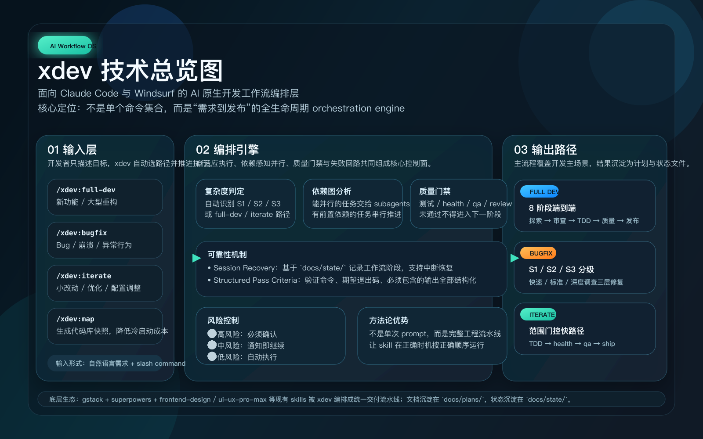

# xdev — AI 原生开发工作流

> **专注交付，而非仪式。** xdev 是一套面向 Claude Code、Codex CLI 和 dsh（DeepSeek Harness）的生产级 AI 工作流文件，将完整开发生命周期（从需求到发布）的编排、质量门禁、并行执行和失败回路全部内置其中。

[English](./README.md) | 中文 | [版本说明](./CHANGELOG.md)

> **⚠️ 自 v3.0.0 起不再支持 Windsurf IDE。** `windsurf/` 移植目录与 `install.sh windsurf` 目标已移除。依赖它的用户请留在 [v2.3.0 tag](https://github.com/Minokun/xdev/tree/v2.3.0)，或迁移到 Claude Code / Codex / dsh。

---

## 项目总览图



---

## 快速上手（dsh / DeepSeek Harness）

**dsh 是旗舰目标。** xdev 以一等公民形态发布为 dsh agent preset——"xdev 模式"，自带 persona、工具栈和 preset 私有技能。**git clone 即安装**（仓库根已携带生成好的 preset 文件）：

```bash
git clone --depth 1 https://github.com/Minokun/xdev.git ~/.dsh/.agent-presets/xdev
```

dsh 装在非默认位置？用 `${DSH_HOME:-$HOME/.dsh}/.agent-presets/xdev`。

启动（或重启）dsh，模式选择器里即出现 **xdev 模式**。用 dsh 手势触发（也支持出现在句子任意位置；不带手势时 xdev 也会自动路由）：

```
/xdev-full-dev  给设置页面增加深色模式支持
/xdev-bugfix     登录超时后 app 直接崩溃
/xdev-iterate    把首页加载超时从 5s 改为 3s
/xdev-ask        这个项目的鉴权流程怎么走的？
```

**为什么 dsh 是最佳载体** —— xdev 的核心机制在 dsh 里从"写在 prose 里靠模型自觉"变成运行时强制原语：

| xdev 概念（其他 agent 里是 prose 约定） | dsh 原语（运行时强制） |
|---|---|
| "派发没看过父对话的 fresh 审核员" | `spawn` provider 的 `inheritsParentContext: false`——fresh 是契约不是请求 |
| "3 个审查并行跑，丢一个按未知处理" | `workflow` 工具：`parallel()` 是真 barrier，`agent()` 失败返回 `null` 并计数 |
| "审核员必须返回结构化裁决" | `agent(prompt, {schema})`——JSON Schema 校验输出 |
| "强模型规划、便宜模型实现" | 每个子 agent 独立的 `agent(prompt, {provider, model})` |

**升级 / 卸载：**

```bash
git -C ~/.dsh/.agent-presets/xdev pull      # 升级
rm -rf ~/.dsh/.agent-presets/xdev           # 卸载
```

设计依据：[`docs/experiments/dsh-integration/RESEARCH.md`](./docs/experiments/dsh-integration/RESEARCH.md)。

## 快速上手（Claude Code / Codex CLI）

### 1. 安装（一分钟）

克隆 xdev，按你用的 agent 选一个或多个目标（支持多选）：

```bash
git clone --depth 1 https://github.com/Minokun/xdev.git ~/.claude/skills/xdev

# 任选其一，也可一次装多个
bash ~/.claude/skills/xdev/bin/install.sh claude         # Claude Code
bash ~/.claude/skills/xdev/bin/install.sh codex          # Codex CLI（prompts + skills 一起装）
bash ~/.claude/skills/xdev/bin/install.sh claude codex   # 多选
bash ~/.claude/skills/xdev/bin/install.sh all            # claude + codex
```

装完即可使用 `/iterate` 和 `/ask`（rg 模式）。深度命令（`/full-dev`、`/bugfix`、`/ask` 接 Graphify 体检）需要额外 skill，见下方 [安装](#安装) 章节按需补装。缺 skill 时 xdev **优雅降级**到可运行子集，不会崩。

### 2. 直接描述你要做什么

xdev 自动判断复杂度、选路径、执行、验证、发布，不需要手把手引导。

```
# 发现了 bug？
/xdev:bugfix  登录超时后 app 直接崩溃

# 开发新功能？
/xdev:full-dev  给设置页面增加深色模式支持

# 小改动？
/xdev:iterate  把首页加载超时从 5s 改为 3s

# 想读懂项目，或挖一下潜在风险？
/xdev:ask  这个项目的鉴权流程怎么走的？
/xdev:ask  帮我体检一下，有哪些隐患？
```

> 上面用的是 Claude Code 前缀。Codex 用 `/prompts:xdev-full-dev …` 或 `$xdev-full-dev …`；dsh 用 `/xdev-full-dev …`。

> xdev 自动评估严重程度 → 选择对应工作流 → 执行 → 验证 → 发布。

### 可选：主模型 + 轻量子代理模型搭配

xdev 会大量使用 Claude Code subagent 来并行执行独立审查和实现批次。为了获得更好的成本 / 效果平衡，推荐主对话使用最强模型，子代理统一走 Claude Code 的 `haiku` 别名：

```json
{
  "env": {
    "ANTHROPIC_MODEL": "gpt-5.5",
    "ANTHROPIC_DEFAULT_HAIKU_MODEL": "gpt-5.4",
    "CLAUDE_CODE_SUBAGENT_MODEL": "haiku"
  }
}
```

这样配置后，主线程继续使用更强推理模型负责规划、编排和最终判断；所有新派发的 subagent 默认使用 `haiku`，并由这里的 `ANTHROPIC_DEFAULT_HAIKU_MODEL` 映射到 `gpt-5.4`。这很适合 xdev：大量子代理任务本身边界清晰、可并行、上下文较窄，把它们交给轻量模型可以大幅减少 token 消耗，同时把最强模型留给真正需要判断力的环节。

---

## 为什么用 xdev？

AI 命令集合已经很多了。xdev 的不同之处在于：

### 对比 gstack / superpowers / oh-my-codex / oh-my-openagent

| | gstack / superpowers | oh-my-codex | oh-my-openagent | **xdev** |
|--|---------------------|-------------|-----------------|---------|
| 本质 | 独立的 AI 工具命令 | Prompt 模板 / 斜杠命令 | 多 Agent 编排模式（team / ultrawork / autopilot） | **端到端工作流编排** |
| 覆盖范围 | 每条命令处理单一任务 | 每个 Prompt 处理单一任务 | 每条命令按模式并行派发多个 Agent | **完整开发生命周期（设计 → 发布）** |
| 质量门禁 | ❌ | ❌ | ❌ | ✅ 每个阶段有明确通过条件 |
| 失败处理 | ❌ | ❌ | ❌ | ✅ 重试上限 + 升级路径 |
| 跨工具交接 | ❌ | ❌ | ❌ | ✅ Opus 做设计，Codex 做实现 |
| 并行执行 | ❌ | ❌ | ✅ 显式的多 Agent 模式 | ✅ Subagent 并行派发已内建进工作流 |
| 分级执行路径 | ❌ | ❌ | ❌ | ✅ Bug 分 S1/S2/S3（单行快修 vs 跨模块调查） |
| 确认策略 | ❌ | ❌ | ❌ | ✅ 明确的 🔴 用户确认门（不可逆操作、大功能设计） |
| **自适应执行** | ❌ | ❌ | ❌ — 由用户挑选模式 | ✅ 自判断难易等级，自选流程和审查深度 |
| **依赖感知并行** | ❌ | ❌ | ❌ — 按声明并行，不分析任务依赖 | ✅ 分析任务依赖，子代理并行无依赖项 |
| **认知负荷** | 高 — 预判所有场景，手动串联工具 | 高 — 每次都要编写精准 Prompt | 中 — 每次任务需挑对模式和 Agent 组合 | **低 — 只需描述目标，xdev 决定怎么做** |

> **🔴 门禁**（唯一需要用户确认的点）：不可逆操作——部署生产、删数据、强制推送、对外发布（硬规则 4）——以及跨模块 / 不可逆功能的设计确认。其余一律告知即继续。

**gstack 和 superpowers 是优秀的工具** —— 但 xdev v2 起不再依赖它们：它们真正有用的审查逻辑已内化为内置 prompt（`full-dev.md` 附录 A–D），装了照常独立工作，只是 xdev 不再调用。

### 核心理念：信息提取，而非仪式

模型已经很强——大多数"流程规则"只是在复述模型本来就会做的事，这些规则是死重。xdev v2 只保留**能提取出模型从自身上下文里拿不到的信息**的机制：

1. **fresh 独立审核**（无父对话偏见的独立审核员）
2. **diff 对照设计的 drift check**（代码实际做了什么 vs 当初约定了什么）
3. **真实执行的测试/命令**（客观输出，不是"应该会过"）

其余一切——阶段仪式、输出格式、分类表——都是*模型可偏离的默认值*，不是枷锁。所有审核 prompt 内置；**xdev 零必需外部 skill 依赖**。

> 实验依据：三省模式 A/B 实验（`docs/experiments/sansheng/PROPOSAL.md`）显示强审核员之间仍有正交盲区——3 反思在已落地计划上漏掉 8 条真缺陷而 Gate 抓到了；Gate 的 BDD 维度只抓到 1/6 而反思专项 6/6。独立视角不会因为模型变强而变冗余，只是盲区换了位置。（成本：Gate 臂 token 为基线的 57–67%，未达 ≤55% 目标——所以它以可选项发布。）

单独跑测试套件只能告诉你过没过；xdev 规定的是*什么时候才算数*：UI 验证只在全量测试 + lint/build 真实通过、相比改动前无新增失败之后才跑；发现的问题必须修复后重检，超过 2 轮才降级手工验证。**方法论的差距，决定了最终交付质量的差距。**

### 核心洞察

AI 工作流失败的原因通常不是 AI 写不了代码，而是：

1. **没有质量门禁** —— AI 还没完成就进入了下一阶段
2. **一刀切流程** —— 改两行错别字和开发新功能走同一套重型流程
3. **没有失败协议** —— 假设验证失败后 AI 继续猜测，而不是升级
4. **该并行时串行** —— 三个互不依赖的审查依次排队执行

xdev 解决了这四个问题。

### 自适应执行 —— 自我评估，自主选择路径

其他 AI 命令工具给你一套流程，无论改动是 2 行还是 200 行都走同样的串行流水线。xdev 不同：**它在执行前先评估，再决定怎么干。**

```
读取 bug 描述 / 代码状态 / 改动范围
        │
        ▼
  自动判断难易等级
  ├── S1: 根因一眼可见 → 快速路（不开 subagent，只跑聚焦测试）
  ├── S2: 单模块可复现 → 标准路（内联调查，只跑全量测试）
  └── S3: 跨模块/偶发  → 深度路（fresh 调查 subagent + 全量测试 + UI 验证）
```

**任务依赖分析驱动并行：**

```
分析任务依赖图
  ├── 有依赖关系 → 串行，等待前置任务完成
  └── 无依赖关系 → 子代理并行派发，同时执行
                   （3 个独立审查 → 同时跑，而不是依次排队）
```

这是**自主判断执行**，不是盲目跟随固定脚本。AI 读懂上下文，决定投入多大力度、用哪些工具、哪些任务可以并发 —— 每次都选最合适的路径，而不是最保险的全套流程。

---

## 包含什么

6 个工作流文件，覆盖完整开发生命周期：

| 工作流 | Claude Code | Codex | dsh | 使用场景 | 目标时长 |
|--------|-------------|-------|-----|---------|---------|
| **full-dev** | `/xdev:full-dev` | `/prompts:xdev-full-dev` | `/xdev-full-dev` | 新功能、大型重构、跨模块改动 | 数小时~数天 |
| **full-dev-design** | `/xdev:full-dev-design` | `/prompts:xdev-full-dev-design` | — | 仅设计阶段 —— 产出计划后交给实现方执行 | 1~4 小时 |
| **full-dev-impl** | `/xdev:full-dev-impl` | `/prompts:xdev-full-dev-impl` | — | 仅实现阶段 —— 读取设计计划并执行 | 数小时~数天 |
| **bugfix** | `/xdev:bugfix` | `/prompts:xdev-bugfix` | `/xdev-bugfix` | Bug、崩溃、异常行为 | 15 分钟~90 分钟 |
| **iterate** | `/xdev:iterate` | `/prompts:xdev-iterate` | `/xdev-iterate` | 小改动、优化、配置调整 | 15~60 分钟 |
| **ask** | `/xdev:ask` | `/prompts:xdev-ask` | `/xdev-ask` | 只读项目问答 + 主动体检；以"答案最新最准"为最高原则 | 1~5 分钟 |

> **dsh 说明：** dsh 上 `full-dev-design` / `full-dev-impl` 并入 `/xdev-full-dev`——dsh 的子 agent 级 `model` 参数取代了跨工具交接文件（强模型规划、便宜模型实现）。

> **跨工具交接：** `full-dev-design` + `full-dev-impl` 让你为不同阶段选择最合适的模型 —— 用强推理模型（如 Opus）做规划，用快速执行模型（如 Codex）做实现。xdev 通过共享计划文件自动完成交接。

### 具体场景 —— 怎么挑命令

命令本身会自我分级 + 自动降级，不确定时直接说目标即可。下面是一份快速心智模型。

**`/xdev:full-dev`** —— 含未知项 / 多方利益相关 / 跨模块影响的改动。
- 从 0 交付一个新功能：*"给用户中心新增订阅页 + Stripe 计费"*
- 大型重构：*"把 API 路由从 Express 3 升到 Express 5"*
- 会扩散的 schema / 接口契约改动：*"用户表加 organization_id + 历史数据回填 + 改所有读取方"*
- 任何你希望写代码**之前**先由 3 个 fresh 审核员（覆盖 / 依赖 / BDD 质量）把计划过一遍的场景

**`/xdev:full-dev-design`** —— 只做设计，把计划交给另一个模型 / agent 实现。
- Opus / GPT-5 做设计，Codex / 更快的模型做实现
- 你需要一份带风险标签的 TDD 计划，但暂时不写代码
- 设计需要重审查，而你的实现 agent 上下文窗口偏小

**`/xdev:full-dev-impl`** —— 拿一份已确认的设计计划直接落地。
- 接 `full-dev-design` 产出的 `docs/plans/<slug>.md` 继续
- 跨 session：昨天设计、今天实现
- 想用快速执行模型跑已锁定的计划

**`/xdev:bugfix`** —— 任何"坏了 / 崩了 / 行为不对"，自动分级。
- *S1 快路*：明显的 typo、off-by-one、漏 import、单行回归
- *S2 标准*：单模块可复现 bug —— *"注册表单拒绝合法的 `+` 邮箱地址"*
- *S3 深度*：跨模块 / 偶发 / 鉴权或支付敏感 —— *"结算偶发双扣"*

**`/xdev:iterate`** —— 范围内的小改，无意外；超范围会自动升级。
- 文案 / 超时 / 阈值 / 日志级别调整
- 单个组件的样式微调
- ≤ ~100 行、不引新依赖、不改 API 契约。超范围 → 自动升 `full-dev`；发现 bug → 自动升 `bugfix`。

**`/xdev:ask`** —— 只读项目问答 + 主动体检。**绝不**改源码、跑测试、发布。


- *问答模式*（带具体锚点 —— 文件 / 函数 / 路由 / 业务名词）：
  - *"登录鉴权流程端到端是怎么走的？"*
  - *"我给模型 Y 加字段 X，会影响哪些地方？"*
  - *"支付服务的测试入口在哪？哪些覆盖了退款？"*
  - *"`services/billing/charger.ts` 实际做什么？"*
- *体检模式*（无具体问题 —— 跑 6 维巡检清单）：
  - *"帮我体检一下这个项目，有哪些隐患？"*
  - 单维度聚焦：*"看下安全"* / *"测试覆盖"* / *"架构耦合"*
  - 输出 5–10 条带文件/行号证据的高价值发现；任何实际修复让 `/bugfix` 或 `/iterate` 接手。

---

## 工作流架构

### /full-dev —— 4 阶段端到端流水线（v2）

```
阶段 1：设计 —— 功能点 F1..Fn / Must-Not / 验收标准（规模自适应；大功能才需用户确认）
阶段 2：计划与门 —— 任务拆分 → 3 个 fresh 审核（覆盖 ‖ 依赖 ‖ BDD 质量）
        [+ 门下门（--menxia 可选）：approve/reject 二值裁决，封驳强制返工 ≤3 轮]
         ── 交接点（可选，用于跨工具拆分）──
阶段 3：实现与测试 —— TDD 红绿循环 + 任务图并行派发 + drift check + 条件深度审查
阶段 4：交付 —— 全量测试真实通过 → 对抗性 pre-landing review → PR → 可选部署
```

**5 条硬规则**（其余皆为可偏离的默认值）：验证必须真实执行 / fresh 裁决必须执行 / 不碰 base 分支 / 不可逆须确认 / 默认值可偏离（一句话说明）。

### 内置可靠性机制

**会话恢复 / 跨工具交接** —— 阶段 2 结束时写入最小状态文件 `docs/state/xdev--<branch>.md`（分支 / 阶段 / 计划路径 / next action）并 commit 计划。`/full-dev-impl` 以该文件的 next action 续跑，不回放对话；计划文件缺失或锚点 commit 不在历史中 → 提示用户重新规划，不猜。v2 格式状态文件（`full-dev-design--<branch>--<slug>.md`）不再解析——流程会明确告知"用 v2 完成或重新规划"。

**base 分支守卫**（硬规则 3）—— 不向 `main`/`master` 提交。在 base 分支上时先建 `xdev-<slug>` feature 分支，可选放进 `git worktree`（注意 worktree 不带 `.env*` 与构建产物）。PR 合并后在阶段 4 清理 worktree。

**Intent Contract + drift check** —— 设计文档的 F1..Fn / Must Not / 验收标准经用户确认后即为 *Intent Contract*。每批次（~5 commits）后由 fresh subagent 只读契约、设计文档与 diff（附录 B），报告 `[偏离]`（接口 / 数据流 / 模块边界与设计不一致，附 file:line）与 `[超纲]`（用户可见新能力无契约对应）。有偏离 → 用户只能选修代码；要改设计必须显式回到阶段 1。

**Worker 回执 + 主线汇总** —— 独立任务并行派发给 subagent，worker 只返回回执（改了哪些文件 / 跑了什么命令 / 真实输出摘要 / 遇到的问题），不写状态；主线程合并回执并独占状态文件。保持总控上下文干净，防止单方面扩范围。

**审核员失败防静默丢失** —— 计划反思的任一 fresh 审核员失败/超时，重派 1 次后仍失败则标 `missing`，其维度的 HIGH 问题计为「未知＝存在」而非 0，不得基于不完整数据判定「通过」。后台命令必须轮询到终态（"完成后会继续处理"式停轮违反硬规则 1）。

**对抗性 pre-landing review** —— 开 PR 前由 fresh subagent 假设这份 diff *一定会*造成生产事故，找出最可能的 3 个途径（数据丢失 > 安全 > 功能回归 > 性能），每条给触发路径与 file:line 证据；找不到 3 条如实报告，不许凑数（附录 D）。diff 涉及 auth / 支付 / PII / schema / 新依赖时另加一轮条件深度审查（附录 C）。

**门下门（可选，`--menxia`）** —— fresh 审核官对计划整体给出二值 approve/reject，带设计遵从条款（设计已批准 / 豁免 / 列为非目标的决策不构成封驳理由）与注入防护；reject 强制修订并附逐条修改说明，重审 ≤3 轮，第 2 轮起先校验修改说明与计划实际变更是否一致（N4 实验中 4/5 假修复被识破）。灰度：累计 ≥3 次真实任务后转正或移除。

**单一源** —— 只有 `claude-code/` 是手写源。dsh preset 产物（`preset.yml`、`agent.cordis.yml`、`skills/xdev-*/`）由 `bin/gen-dsh.mjs` 生成并提交入库，保证 `git clone` 即完整安装；`tests/workflows.test.mjs` 在产物过期、工作流重新引入外部 skill 调用、或 `bugfix` / `iterate` 超出薄壳预算时失败。

### /bugfix —— 先找根因，再走 full-dev 阶段 3–4 循环

```
分级（S1 快修 / S2 标准 / S3 深度 —— 按证据判定，不按时钟）
  ├── S1：回归测试 → 修 → 聚焦测试 → 推分支（不开 PR）
  ├── S2：内联定位 → TDD → 全量测试 → 交付
  └── S3：git blame/bisect → 卡住则 fresh 调查 subagent → TDD → 全量测试 + UI 验证 → 交付
范围检查的 Intent Contract = 根因报告中的"预期影响范围"
```

### /iterate —— 范围门控快速路径

```
范围门（<100 行 · ≤5 文件 · ≤2 模块 · 不引新依赖 · 不改公开 API）
  ├── auth / 支付 / schema / 公开 API / 新页面 → /full-dev
  ├── 描述的是错误行为而非改动 → /bugfix
  └── 在范围内 → rg 列出共享文件的直接调用方 → TDD → 全量测试 + lint/build → 交付
```

### 项目上下文 —— 不设仪式

工作流读项目自己的 `CLAUDE.md` / `AGENTS.md`，用 `rg` + 读文件建立上下文。没有内置的"快照"或"先了解项目"步骤。`/ask` 在存在 Graphify 图谱时额外用它（见第 2.6 步），没有则降级 `rg`——每个答案都注明所依据的数据源。

---

## 安装

### TL;DR — 1 行装 xdev 本体

```bash
git clone --depth 1 https://github.com/Minokun/xdev.git ~/.claude/skills/xdev
~/.claude/skills/xdev/bin/install.sh claude    # 或：codex / "claude codex" / "all"
```

完事。`/iterate` 和 `/ask`（rg 模式）已经能用。深度命令（`/full-dev`、`/bugfix`、`/ask` 接 Graphify 的体检模式）需要额外 skill，但缺 skill 时 xdev **优雅降级**到能运行的子集，不会崩。dsh 用户见上方[快速上手（dsh）](#快速上手dsh--deepseek-harness)——一条 `git clone` 即可，无需安装脚本。

### 选择安装层级（按需选）

xdev 自身只是工作流文件，重活由外部 skill 完成。按你要用的功能挑装：

| 想用什么 | 需要装 | 累计时间 |
|---------|--------|---------|
| `/iterate`、`/ask`、`/bugfix`、`/full-dev` 全部功能 | **xdev 本体** | 1 分钟 |
| **dsh "xdev 模式" preset**（以上全部，以原生 dsh 技能形态） | `git clone` 到 `~/.dsh/.agent-presets/xdev`——见[快速上手（dsh）](#快速上手dsh--deepseek-harness) | 1 分钟 |
| `/ask` 的代码图谱上下文 | + **Graphify**（第 2.6 步；已装视为隐式授权 LLM 抽取） | +2 分钟 |

> Graphify 缺失时 `/ask` 自动降级 `rg`，不报错。

### 让 Claude Code 全自动安装（替代方案）

如果你用 Claude Code 且想让 AI 一次装全，粘贴以下提示词到任意 Claude Code 会话：

```
请帮我安装 xdev 及其依赖：

1. xdev 本体（必装）：
   执行：git clone --depth 1 https://github.com/Minokun/xdev.git ~/.claude/skills/xdev
   然后：~/.claude/skills/xdev/bin/install.sh claude
   （如果同时用 Codex CLI，把 `claude` 换成任意组合，例如 `claude codex` 或 `all`。）

2. Graphify（可选——仅 /ask 使用）：
   执行：uv tool install graphifyy
   验证：graphify --help
   注意：PyPI 包名是 graphifyy，请勿安装无关的 graphify 包。

全部完成后，请确认文件已就位，并告诉我现在可以使用哪些 xdev 命令。
```

> 上方提示词只覆盖 Claude Code。其它 agent 用户请按下方“逐项详细安装”逐步执行。

---

## 逐项详细安装

> **v2 起 superpowers / gstack 步骤已移除**：xdev 不再依赖任何外部 skill 库。
> 原先由 gstack/superpowers 提供的审查能力（计划反思、偏差检测、对抗性 pre-landing review）
> 已内化为 `full-dev.md` 的内置 prompt（附录 A–D）。以下仅为可选增强。

### 第 2.6 步 —— Graphify（可选；只有 `/ask` 用它）

[Graphify](https://github.com/Graphify-Labs/graphify) 构建代码知识图谱，`/ask` 用它回答架构 / 调用链 / 死代码类问题。没装时 `/ask` 降级为 `rg` 并在 `Unknowns` 说明。xdev 其余部分不依赖它。

```bash
uv tool install graphifyy          # 需要 Python 3.10+
graphify --version
```

然后在项目里跑一次 `/graphify` skill 生成 `graphify-out/`。`/ask` 检测到过期会自动刷新（纯代码变化走 `graphify update .`；语义重抽取走 skill，会披露代价）。xdev 从不执行 `graphify install` / `watch` / `hook install`。

### 第三步 —— 安装 xdev 本体

克隆仓库到固定位置：

```bash
git clone --depth 1 https://github.com/Minokun/xdev.git ~/.claude/skills/xdev
```

跑安装脚本（幂等可重跑，自动创建、更新、修复软链）：

```bash
# Claude Code 全局
bash ~/.claude/skills/xdev/bin/install.sh claude

# Codex CLI（同时安装 custom prompts 和 skills，调用方式见下）
bash ~/.claude/skills/xdev/bin/install.sh codex

# 多选：任意组合（等价于 all 减去你不想装的）
bash ~/.claude/skills/xdev/bin/install.sh claude codex
bash ~/.claude/skills/xdev/bin/install.sh all                # = claude codex

# 预览不写入
bash ~/.claude/skills/xdev/bin/install.sh claude --dry-run

# 自定义目标目录（高级；codex 不支持）
bash ~/.claude/skills/xdev/bin/install.sh claude --target /your/custom/path
```

#### Windows（原生，通过 Git Bash）

xdev 直接装到**原生 Windows** 的 Codex CLI / Claude Code 下——目录结构和 macOS/Linux 一致，只是放在 `%USERPROFILE%` 下。安装脚本是 bash 写的，所以从 **Git Bash** 跑（一次性配好，[Git for Windows](https://gitforwindows.org/) 自带）。**不走 WSL**。

一次性配置：

1. 装 Git for Windows（自带 Git Bash），如果还没装的话。
2. 打开 **开发者模式**，让非管理员用户能创建 symlink：
   `设置 → 系统 → 开发者选项 → 开发人员模式 → 开`（Windows 10 1607+ / Windows 11）。
   未开启时 `ln -s` 会退化为复制甚至失败。

然后在 Git Bash 里：

```bash
git clone --depth 1 https://github.com/Minokun/xdev.git "$USERPROFILE/.claude/skills/xdev"
bash "$USERPROFILE/.claude/skills/xdev/bin/install.sh" codex          # 只装 Codex
bash "$USERPROFILE/.claude/skills/xdev/bin/install.sh" claude codex   # 多选
bash "$USERPROFILE/.claude/skills/xdev/bin/install.sh" all
```

落地路径就是各 agent 在 Windows 上原本就在读的位置：

| Agent | Windows 路径 |
|---|---|
| Claude Code | `%USERPROFILE%\.claude\commands\xdev\` |
| Codex prompts | `%USERPROFILE%\.codex\prompts\` |
| Codex skills | `%USERPROFILE%\.agents\skills\` |
| dsh preset | `%USERPROFILE%\.dsh\.agent-presets\xdev\`（git clone） |

> 暂未提供原生 PowerShell 安装器。如果你需要 `pwsh bin/install.ps1`，欢迎开 issue 反馈。

调用方式：

```
Claude Code:     /xdev:full-dev          /xdev:full-dev-design          /xdev:full-dev-impl          /xdev:bugfix          /xdev:iterate          /xdev:ask
Codex (prompts): /prompts:xdev-full-dev  /prompts:xdev-full-dev-design  /prompts:xdev-full-dev-impl  /prompts:xdev-bugfix  /prompts:xdev-iterate  /prompts:xdev-ask
Codex (skills):  $xdev-full-dev          $xdev-full-dev-design          $xdev-full-dev-impl          $xdev-bugfix          $xdev-iterate          $xdev-ask
dsh preset:      /xdev-full-dev          （design/impl 已并入）         （design/impl 已并入）       /xdev-bugfix          /xdev-iterate          /xdev-ask
```

> **Codex 安装结构。** 选 `codex` 会同时落两个入口，你按场景挑用即可：
> - `~/.codex/prompts/xdev-*.md` —— 软链到 `claude-code/*.md`，用 `/prompts:xdev-<名字>` 显式调用（Codex 已标记 deprecated 但仍支持的 custom prompts 路径，保留 `argument-hint`）。
> - `~/.agents/skills/xdev-*/SKILL.md` —— 安装时生成的薄壳（带 `<!-- xdev-generated -->` 标记，每次重装都会重写）。用 `$xdev-<名字>` 显式调用，或让 Codex 通过 description 隐式匹配。壳里指向同一个 `claude-code/*.md`，所以 `git pull` 一次就同时更新两个入口。

**更新 xdev：**

```bash
cd ~/.claude/skills/xdev && git pull
```

> Claude Code 用的是目录软链，`git pull` 后无需重跑安装脚本。
> Codex 用的是逐文件软链（附带生成的 `SKILL.md` 薄壳）；如果发布说明里有新增 / 改名 / 改 description 的工作流文件，请用相同的 agent 目标重跑安装脚本以刷新软链和重生成 skill 薄壳。
> dsh 用独立 clone——`git -C ~/.dsh/.agent-presets/xdev pull` 升级（或按 `DSH_HOME` 相应调整）。

### Skill 来源对照表

| Skill | 来源 | 使用位置 |
|-------|------|---------|
| （gstack/superpowers 全部 skills） | **已内化，不再引用** | 计划反思 = `full-dev.md` 附录 A；偏差检测 = 附录 B；条件深度审查 = 附录 C；pre-landing 对抗审查 = 附录 D；health/qa = 真实执行的测试命令；ship/learn = 内联交付与可选复盘 |
| `graphify` CLI | 可选 | 仅 `/ask`（第 2.6 步） |
| `ui-ux-pro-max` | 不再被任何工作流引用 | 想要设计指引可独立安装 |

---

## 设计原则

1. **流程与任务对等** —— 小 bug 走小流程，大功能走大流程，绝不反过来。
2. **根因而非症状** —— 没有证据不做修复，没有调查不做假设。
3. **测试先行** —— 回归测试必须先 FAIL，修复后 PASS。没有例外。
4. **原子提交** —— 每个改动独立可 bisect。
5. **独立时并行** —— 审查与独立任务无依赖时并发执行。
6. **显式升级** —— 每条失败路径都有明确的下一步，没有无限循环。
7. **最小足迹** —— 不重构没有破坏的代码，不审查没有改动的内容。

---

## 门禁类型：机械 vs 判断

xdev 的所有质量门禁分两类，**不要混淆**——混淆是一个常见失败模式，这一节把术语钉死。

### 机械门禁 (Mechanical Gate)

- **判定主体**：脚本/命令
- **信号**：退出码、精确文本匹配（grep）、字节级可复现
- **举例**：`pass criteria` — `期望退出码 = 0` / `输出必须包含 "1 passed"` / `curl 探针返回 200`
- **规则**：**必须严格二元**（通过 / 不通过）。无灰度，无"差不多就行"。

### 判断门禁 (Judgement Gate)

- **判定主体**：LLM 或人类
- **信号**：语义评估——同输入两次运行可能略有差异
- **举例**：计划反思的 HIGH/MEDIUM 计数、drift check 的 `[偏离]`/`[超纲]` tally、门下门 approve/reject、pre-landing 审查发现项、`/iterate` 范围门的升级判断
- **规则**：**接受量表和评分**，但**评估维度必须列明**（禁止黑盒"总体还行"）。每个维度独立通过，**不得将多维度平均为综合分**。

### 反模式

**不要把判断门禁强行压成单条 Yes/No。** 比如"代码设计是否合理?" 一条二元问题制造伪精确——LLM 还是要做同样的主观判断，你只是丢失了分辨率。二元化的真正红利只对机械门禁成立（那里脚本能真正裁决）。

推论：想收紧某条门禁时，先问"这是机械还是判断？"。机械 → 加退出码 / grep / 探针。判断 → 加评估维度，**不是**加 Yes/No。

> 这一区分的演化历史（包含被尝试和放弃的方向）见 `docs/CHANGELOG.md`。

---

## 文件结构

```
xdev/
├── README.md              ← 英文版文档
├── README.zh.md           ← 本文件（中文版文档）
├── preset.yml             ← dsh preset 元数据（生成产物——"xdev 模式"）
├── agent.cordis.yml       ← dsh preset 组合（生成产物——persona + 工具栈）
├── skills/                ← dsh preset 私有技能（生成产物，源自 claude-code/）
│   ├── xdev-ask/SKILL.md
│   ├── xdev-bugfix/SKILL.md
│   ├── xdev-iterate/SKILL.md
│   └── xdev-full-dev/SKILL.md
├── docs/experiments/      ← 三省模式实验 + dsh 集成调研（preset 设计依据）
├── bin/
│   ├── install.sh         ← 创建软链，幂等可重跑（claude / codex）
│   └── gen-dsh.mjs        ← 从 claude-code/ 生成 dsh preset 产物
└── claude-code/           ← 唯一手写源；.claude/commands/xdev/ 与 Codex prompts 软链到这里
    ├── full-dev.md
    ├── full-dev-design.md
    ├── full-dev-impl.md
    ├── bugfix.md
    ├── iterate.md
    └── ask.md
```

---

## 贡献

欢迎参与贡献！你可以：

- 提 issue 反馈 bug、提问或建议新工作流
- 提 PR 改进或扩展现有工作流文件——只改 `claude-code/`，然后跑 `node bin/gen-dsh.mjs` 与 `node --test tests/`
- 分享你如何将 xdev 适配到自己的技术栈

---

## License

[MIT](./LICENSE)
